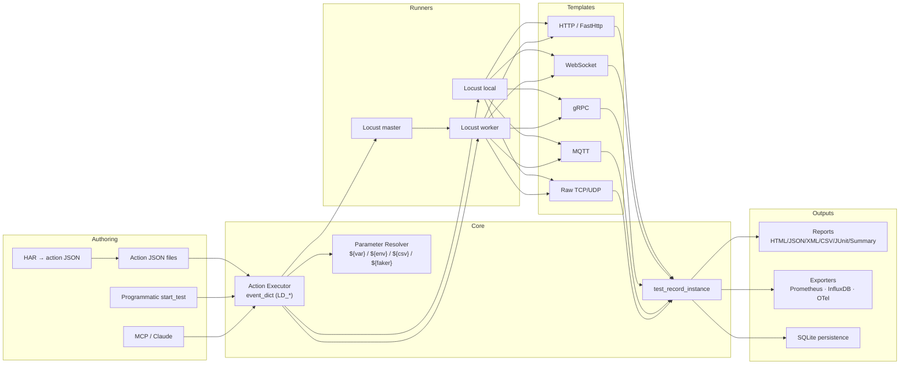
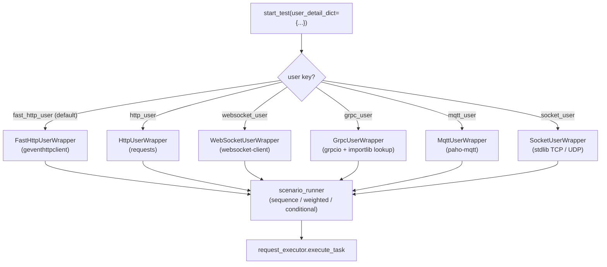

# LoadDensity

<p align="center">
  <strong>Multi-protocol load & stress automation: Locust + WebSocket + gRPC + MQTT + raw sockets, behind one JSON-driven action executor with batteries included.</strong>
</p>

<p align="center">
  <a href="https://pypi.org/project/je-load-density/"></a>
  <a href="https://pypi.org/project/je-load-density/"></a>
  <a href="https://github.com/Integration-Automation/LoadDensity/blob/main/LICENSE"></a>
  <a href="https://loaddensity.readthedocs.io/en/latest/"></a>
</p>

<p align="center">
  <a href="README/README_zh-TW.md">繁體中文</a> |
  <a href="README/README_zh-CN.md">简体中文</a>
</p>

---

LoadDensity (`je_load_density`) started as a Locust wrapper and grew into a full multi-protocol load framework: HTTP, FastHttp, WebSocket, gRPC, MQTT, and raw TCP/UDP user templates behind one JSON-driven action executor, plus modules for parameterised data, scenario flow, reports, observability, distributed runners, recording, persistent storage, and an MCP control surface so Claude can drive load tests end-to-end. Every executor command has a deterministic name (`LD_*`) and a single dispatch point, so an action JSON can mix protocols, exporters, and reports in the same script.

> **Optional dependencies, opt-in install** — every protocol driver and exporter ships behind a `pip install je_load_density[<extra>]` extra. The base install footprint is unchanged for users who only need HTTP load testing.

## Table of Contents

- [Highlights](#highlights)
- [Installation](#installation)
- [Architecture](#architecture)
  - [System overview](#system-overview)
  - [Action lifecycle](#action-lifecycle)
  - [User dispatch](#user-dispatch)
  - [Module map](#module-map)
- [Quick Start](#quick-start)
- [Recipes](#recipes)
- [Core API](#core-api)
- [Action Executor](#action-executor)
- [User Templates](#user-templates)
  - [HTTP / FastHttp](#http--fasthttp)
  - [WebSocket](#websocket)
  - [gRPC](#grpc)
  - [MQTT](#mqtt)
  - [Raw TCP / UDP](#raw-tcp--udp)
- [Parameter Resolver](#parameter-resolver)
- [Scenario Modes](#scenario-modes)
- [Assertions & Extractors](#assertions--extractors)
- [Reports](#reports)
- [Observability](#observability)
- [Distributed Master / Worker](#distributed-master--worker)
- [HAR Record / Replay](#har-record--replay)
- [Persistent Records (SQLite)](#persistent-records-sqlite)
- [MCP Server (for Claude)](#mcp-server-for-claude)
- [Hardened Control Socket](#hardened-control-socket)
- [SLA Gates & Regression Diff](#sla-gates--regression-diff)
- [Load Shapes](#load-shapes)
- [Think Time & Throttle](#think-time--throttle)
- [Importers](#importers)
- [Action JSON Linter, Schema & LSP](#action-json-linter-schema--lsp)
- [GitHub Actions Annotations](#github-actions-annotations)
- [Reliability](#reliability)
- [Live Dashboard](#live-dashboard)
- [Slack / Teams / StatsD](#slack--teams--statsd)
- [Auth](#auth)
- [k6 / JMeter Importers](#k6--jmeter-importers)
- [GitHub Action & pre-commit](#github-action--pre-commit)
- [VS Code Extension](#vs-code-extension)
- [Examples & Local Lab](#examples--local-lab)
- [GUI](#gui)
- [CLI Usage](#cli-usage)
- [Test Record](#test-record)
- [Exception Handling](#exception-handling)
- [Logging](#logging)
- [Supported Platforms](#supported-platforms)
- [More Modules](#more-modules)
- [License](#license)

## Highlights

- **One executor, 41 user types.** HTTP, FastHttp, **Async HTTP/2 (httpx)**, HTTP/3, WebSocket, SSE, gRPC (unary + server/client/bidi streaming), MQTT, raw TCP/UDP, SQL (SQLAlchemy), Redis, Kafka, **MongoDB**, and many more (AMQP, NATS, Pulsar, Cassandra, Elasticsearch, Modbus, OPC-UA, LDAP, SNMP, SMTP/IMAP, FTP/SFTP, …) — all dispatched from the same `LD_start_test` command through a `user_detail_dict["user"]` key.
- **Action JSON as a contract.** Every command resolves through `Executor.event_dict`; the action list is the same whether it is hand-authored, generated by HAR import, sent over the control socket, or driven by an MCP tool.
- **Parameter resolver everywhere.** `${var.NAME}`, `${env.NAME}`, `${csv.SOURCE.COL}`, `${db.SOURCE.COL}`, `${faker.method}`, plus built-in `${uuid()}`, `${now()}`, `${randint(min,max)}` helpers; values extracted from one response can feed the next task's URL, headers, body, or assertions.
- **Scenario flow without Python.** Declare tasks as `sequence` (default), `weighted`, or `conditional` with `run_if` / `skip_if` predicates; per-task `think_time`, `throttle.rps`, and `retry` (`{transient, flaky, permanent}` budgets) control pacing & resilience without writing wait loops.
- **Built-in load shapes.** `load_shape="stages"|"spike"|"soak"` with a JSON `shape_config` — no Locust subclass required.
- **Production-grade reliability.** Adaptive retry with exponential backoff + jitter + per-error-class budgets, sliding-window failure budget / circuit breaker, process supervisor with hard-timeout watchdog, in-process network conditioner (latency / jitter / loss).
- **SLA gates + regression diff.** `LD_assert_sla` fails CI when latency / failure-rate / request-count rules breach; `LD_diff_runs` compares two SQLite-persisted runs and flags per-name regressions over a tolerance.
- **Seven report formats.** HTML, JSON, XML, CSV, JUnit XML, percentile-summary JSON, plus optional matplotlib **chart reports** (`latency-over-time` + `RPS-over-time` PNGs via `[charts]` extra).
- **Four live exporters.** Prometheus HTTP endpoint, InfluxDB line-protocol UDP/HTTP sink, OpenTelemetry OTLP gRPC exporter, **Datadog DogStatsD UDP** sink — all lazily imported and gated by the matching install extra.
- **Live web dashboard.** `start_dashboard()` boots a stdlib HTTP + SSE server that streams running RPS / avg / p95 / failure counts to any browser, per-name table included.
- **Slack + Teams notifiers.** Block Kit + MessageCard summary posters keyed off the build_summary output (`LD_post_slack_summary`, `LD_post_teams_summary`).
- **Assertions + extractors.** `status_code`, `contains`, `not_contains`, `json_path`, `header` assertions run under Locust's `catch_response`; extractors with sources `json_path` / `header` / `status_code` write back into the parameter resolver.
- **Distributed runners.** `runner_mode="master"` / `"worker"` for cross-machine load with the same `start_test` API; master waits up to 60 s for the configured worker count before ramping.
- **Six importers.** HAR (browser traffic), Postman v2.1 collections, OpenAPI 3.x specs, standalone cURL commands, **k6 scripts**, and **JMeter JMX** plans — each converts to action JSON or a single task ready for `LD_start_test`.
- **Auth helpers.** Stdlib OAuth2 client (`client_credentials` / `password` / `refresh` with token cache), JWT signer (HS256/384/512 + RS256/384/512), AWS SigV4 request signer, plus mTLS client-cert support on every HTTP user template via `task["cert"]`.
- **Persistent records.** Optional SQLite sink with `runs` / `records` / `metadata` schema, indexed for cross-run regression checks; works against an empty file out of the box.
- **MCP server.** `python -m je_load_density.mcp_server` exposes 13 tools so Claude (Desktop, Code, any MCP client) can run tests, manage projects, and pull reports without leaving chat.
- **Action JSON tooling.** Built-in linter (`LD_lint_action`), JSON Schema exporter (`LD_export_schema`), GitHub Actions annotation emitter (`LD_emit_github_annotations`), stdlib LSP server (`python -m je_load_density.action_lsp`), composite **GitHub Action** wrapper (`action.yml`), **pre-commit hook**, and **VS Code extension** skeleton — editor + CI integration end-to-end.
- **Hardened control socket.** 4-byte big-endian length-prefix framing (1 MiB cap), optional TLS via `ssl.create_default_context`, shared-secret token via env var or arg, plus a backwards-compatible legacy mode for downstream tools such as PyBreeze.
- **Safe executor.** An action JSON file can call the `LD_*` commands and nothing else except a 22-name builtin allowlist (`print`, `len`, `sorted`, `sum`, …). Everything outside it — `eval`, `exec`, `compile`, `__import__`, `open`, `input`, and the attribute and scope builtins `getattr` / `setattr` / `vars` / `globals` — is simply not registered, so it cannot be dispatched.
- **Live GUI.** Optional PySide6 front-end with a live stats panel (RPS / avg / p95 / failures), translated to English, Traditional Chinese, Japanese, and Korean.
- **CLI subcommands.** `run` / `run-dir` / `run-str` / `init` / `bench` / `shell` / `serve`. Legacy `-e/-d/-c/--execute_str` single-flag form is preserved for downstream tools.
- **Cross-platform.** Windows 10/11, macOS, Ubuntu/Linux, Raspberry Pi (3B+ and later) on Python 3.10+.

## Installation

**Stable:**

```bash
pip install je_load_density
```

Pulls in [Locust](https://locust.io/) and `defusedxml` — nothing else.

### Optional extras

Install only the slices you use:

| Extra | Adds |
|-------|------|
| `gui` | PySide6 + qt-material (graphical front-end) |
| `websocket` | `websocket-client` (WebSocket user template) |
| `grpc` | `grpcio` + `protobuf` (gRPC user template) |
| `mqtt` | `paho-mqtt` (MQTT user template) |
| `redis` | `redis` (Redis user template) |
| `kafka` | `kafka-python` (Kafka user template) |
| `sql` | `sqlalchemy` (SQL user template + `${db.*}` placeholder) |
| `mongo` | `pymongo` (MongoDB user template) |
| `http2` | `httpx[http2]` (Async HTTP/2 user template) |
| `auth` | `cryptography` (RS256/384/512 JWT signing) |
| `reliability` | `psutil` (ProcessSupervisor) |
| `prometheus` | `prometheus-client` (Prometheus exporter) |
| `opentelemetry` | OpenTelemetry SDK + OTLP gRPC exporter |
| `metrics` | `prometheus` + `opentelemetry` bundle |
| `charts` | `matplotlib` (chart-rendering reports) |
| `yaml` | `pyyaml` (OpenAPI YAML loading) |
| `faker` | `Faker` (powers `${faker.method}` placeholders) |
| `all` | Everything above |

```bash
pip install "je_load_density[gui]"
pip install "je_load_density[mqtt,grpc,websocket]"
pip install "je_load_density[metrics]"
pip install "je_load_density[all]"
```

### Development install

```bash
git clone https://github.com/Integration-Automation/LoadDensity.git
cd LoadDensity
pip install -e ".[all]"
pip install -r requirements.txt
```

Hard requirements: Python **3.10+**, `locust`, `defusedxml`.

## Architecture

### System overview



### Action lifecycle

```mermaid
flowchart LR
  IN["Action<br/>[cmd, args_or_kwargs]"] --> DISP["event_dict[cmd]"]
  DISP -- "LD_start_test" --> SEED["Seed resolver from<br/>variables / csv_sources"]
  SEED --> PICK["Pick user template<br/>(_USER_REGISTRY)"]
  PICK --> ENV["prepare_env<br/>(local / master / worker)"]
  ENV --> RUN["Locust runner ticks"]
  RUN --> EXPAND["Parameter resolver<br/>expands ${...} per task"]
  EXPAND --> EXEC["execute_task<br/>(per-protocol request)"]
  EXEC -- response --> ASSERT["assertions + extractors"]
  ASSERT --> EVT["Locust request event"]
  EVT --> REC["test_record_instance.append"]
  DISP -- "LD_generate_*_report" --> RREAD["Read from test_record_instance"]
  RREAD --> OUT["Report file(s)"]
```



### User dispatch



### Module map

```
je_load_density/
├── __init__.py                       # Public API re-exports
├── __main__.py                       # CLI: run / run-dir / run-str / init / serve
├── gui/                              # Optional PySide6 front-end
│   ├── language_wrapper/             # En / zh-TW / Ja / Ko translations
│   ├── load_density_gui_thread.py    # Worker thread for non-blocking starts
│   ├── log_to_ui_filter.py           # Forward logger records to the UI pane
│   ├── main_widget.py                # Form-based test configurator
│   ├── main_window.py                # PySide6 main window shell
│   └── stats_panel.py                # Live RPS / avg / p95 / failures panel
├── mcp_server/                       # MCP server (13 tools for Claude)
│   ├── __main__.py
│   └── server.py
├── utils/
│   ├── callback/                     # callback_executor (post-action callbacks)
│   ├── exception/                    # LoadDensity* exception hierarchy + tags
│   ├── executor/                     # Executor class · event_dict · safe builtins
│   ├── file_process/                 # Directory walker · project scaffolder
│   ├── generate_report/              # HTML / JSON / XML / CSV / JUnit / Summary
│   ├── get_data_structure/           # API data helper (legacy)
│   ├── json/                         # JSON read/write · placeholder normaliser
│   ├── logging/                      # Configured load_density_logger
│   ├── metrics/                      # Prometheus · InfluxDB · OpenTelemetry sinks
│   ├── package_manager/              # Dynamic package loader (LD_add_package_*)
│   ├── parameterization/             # ParameterResolver + CSV / faker sources
│   ├── project/                      # Project template + create_project_dir
│   ├── recording/                    # HAR → action JSON converter
│   ├── socket_server/                # Length-framed TCP control plane (+TLS+token)
│   ├── test_record/                  # In-memory record list + SQLite persistence
│   └── xml/                          # defusedxml-backed XML helpers
└── wrapper/
    ├── create_locust_env/            # prepare_env / create_env (local/master/worker)
    ├── event/                        # request_hook (binds Locust events → records)
    ├── proxy/                        # Per-protocol task store (locust_wrapper_proxy)
    │   └── user/                     # fast_http / http / websocket / grpc / mqtt / socket
    ├── start_wrapper/                # start_test dispatcher (_USER_REGISTRY)
    └── user_template/                # Locust user classes + scenario_runner + request_executor
load_density_driver/                  # Standalone driver builds
test/                                 # pytest test suite
docs/                                 # Sphinx documentation (En / Zh / API)
```

## Quick Start

### HTTP load test in Python

```python
from je_load_density import start_test

start_test(
    user_detail_dict={"user": "fast_http_user"},
    user_count=50,
    spawn_rate=10,
    test_time=30,
    variables={"base": "https://httpbin.org"},
    tasks=[
        {"method": "get",  "request_url": "${var.base}/get"},
        {"method": "post", "request_url": "${var.base}/post",
         "json": {"hello": "world"},
         "assertions": [{"type": "status_code", "value": 200}]},
    ],
)
```

### Action JSON

```json
{"load_density": [
  ["LD_register_variables", {"variables": {"base": "https://httpbin.org"}}],
  ["LD_start_test", {
    "user_detail_dict": {"user": "fast_http_user"},
    "user_count": 20, "spawn_rate": 10, "test_time": 30,
    "tasks": [
      {"method": "get",  "request_url": "${var.base}/get"},
      {"method": "post", "request_url": "${var.base}/post",
       "json": {"hello": "world"}}
    ]
  }],
  ["LD_generate_summary_report", {"report_name": "smoke"}]
]}
```

Run via the CLI:

```bash
python -m je_load_density run smoke.json
```

### Action shapes

```python
["command"]                                    # no args
["command", {"key": "value"}]                  # kwargs
["command", [arg1, arg2]]                      # positional
```

The top-level document is either a bare list or a `{"load_density": [...]}` wrapper.

## Recipes

Short copy-paste snippets covering the most common needs. Each works as either a Python `start_test` call or the `LD_start_test` action.

| Recipe | Demonstrates |
|---|---|
| **HTTP smoke** | `fast_http_user` + `status_code` assertion + summary report. |
| **Auth flow** | `extract` token from login response, reuse via `${var.auth}` header on protected calls. |
| **Weighted mix** | `mode: "weighted"` with `weight` per task to skew traffic toward hot endpoints. |
| **WebSocket echo** | `websocket_user` `connect → sendrecv → close` with `expect` substring assertion. |
| **gRPC unary** | `grpc_user` with `stub_path` / `request_path` + metadata tuple list + per-call timeout. |
| **MQTT pub/sub** | `mqtt_user` `connect → subscribe → publish → disconnect` against a local broker. |
| **Raw TCP/UDP** | `socket_user` with `payload` (text or `hex:…`) and `expect_substring`. |
| **Distributed run** | One `runner_mode="master"` + N `runner_mode="worker"` processes against the same action JSON. |
| **HAR replay** | `LD_load_har` → `LD_har_to_action_json` with regex include / exclude. |
| **Metrics export** | `LD_start_prometheus_exporter`, `LD_start_influxdb_sink`, `LD_start_opentelemetry_exporter`. |
| **Persist results** | `LD_persist_records` to SQLite with `label` + `metadata`, then `LD_list_runs` for trend. |
| **MCP-driven** | Wire Claude to `python -m je_load_density.mcp_server` and call `run_test` / `generate_reports`. |
| **SLA gate** | `LD_assert_sla` with `latency_p95` / `failure_rate` rules to fail CI on regression. |
| **Spike shape** | `load_shape="spike"` + `shape_config` to drive baseline → spike → baseline ramp. |
| **Think time + throttle** | `task["think_time"]` and `task["throttle"]={"rps":...}` to pace traffic. |
| **Postman / OpenAPI / cURL** | `LD_postman_to_action_json` / `LD_openapi_to_action_json` / `LD_curl_to_task` for one-shot imports. |
| **Redis / Kafka / SQL** | Use `user_detail_dict={"user": "redis_user"}` etc with protocol-specific task fields. |

Pair the table with the dedicated chapter (see Table of Contents) for the full parameter surface.

## Core API

```python
from je_load_density import (
    start_test, prepare_env, create_env,
    execute_action, execute_files, executor, add_command_to_executor,
    test_record_instance, locust_wrapper_proxy,
    register_variable, register_variables,
    register_csv_source, register_csv_sources,
    parameter_resolver, resolve,
    har_to_action_json, har_to_tasks, load_har,
    persist_records, list_runs, fetch_run_records,
    start_prometheus_exporter, stop_prometheus_exporter,
    start_influxdb_sink, stop_influxdb_sink,
    start_opentelemetry_exporter, stop_opentelemetry_exporter,
    start_load_density_socket_server,
    generate_html_report, generate_json_report, generate_xml_report,
    generate_csv_report, generate_junit_report, generate_summary_report,
    build_summary,
    create_project_dir, callback_executor, read_action_json,
)
```

The full public surface lives in `__all__` at `je_load_density/__init__.py`.

## Action Executor

The action executor maps a string command name to a Python callable. Every backend, exporter, and report helper registers under `event_dict`.

### Built-in `LD_*` commands

| Group | Commands |
|-------|----------|
| Core | `LD_start_test`, `LD_execute_action`, `LD_execute_files`, `LD_add_package_to_executor`, `LD_start_socket_server` |
| Reports | `LD_generate_html(_report)`, `LD_generate_json(_report)`, `LD_generate_xml(_report)`, `LD_generate_csv_report`, `LD_generate_junit_report`, `LD_generate_summary_report`, `LD_generate_chart_report`, `LD_summary` |
| Persistence | `LD_persist_records`, `LD_list_runs`, `LD_fetch_run_records`, `LD_clear_records` |
| Parameters | `LD_register_variable(s)`, `LD_register_csv_source(s)`, `LD_register_db_source(s)`, `LD_clear_resolver` |
| Recording | `LD_load_har`, `LD_har_to_*`, `LD_postman_to_*`, `LD_openapi_to_*`, `LD_curl_to_task`, `LD_k6_script_to_*`, `LD_jmeter_to_*` |
| Metrics | `LD_start/stop_prometheus_exporter`, `LD_start/stop_influxdb_sink`, `LD_start/stop_opentelemetry_exporter`, `LD_start/stop_statsd_sink` |
| Quality / DX | `LD_lint_action`, `LD_lint_action_file`, `LD_export_schema`, `LD_emit_github_annotations` |
| SLA / regression | `LD_evaluate_sla`, `LD_assert_sla`, `LD_diff_runs` |
| Reliability | `LD_install_failure_budget`, `LD_uninstall_failure_budget`, `LD_install_network_conditioner`, `LD_uninstall_network_conditioner` |
| Dashboard / notify | `LD_start_dashboard`, `LD_stop_dashboard`, `LD_post_slack_summary`, `LD_post_teams_summary` |

Safe Python built-ins (`print`, `len`, `range`, …) are also accepted; `eval`, `exec`, `compile`, `__import__`, `breakpoint`, `open`, and `input` are explicitly blocked.

### Custom commands

```python
from je_load_density import add_command_to_executor

def slack_notify(message: str) -> None:
    ...

add_command_to_executor({"LD_slack_notify": slack_notify})
```

## User Templates

Every template registers under `start_test` via `user_detail_dict={"user": "<key>"}`. Tasks share the same shape across HTTP, WebSocket, gRPC, MQTT, and raw socket users; only the protocol-specific fields differ.

### HTTP / FastHttp

```python
start_test(
    user_detail_dict={"user": "fast_http_user"},
    user_count=50, spawn_rate=10, test_time=60,
    variables={"base": "https://api.example.com"},
    tasks=[
        {"method": "post", "request_url": "${var.base}/login",
         "json": {"email": "u@example.com", "password": "secret"},
         "extract": [{"var": "auth", "from": "json_path", "path": "data.token"}]},
        {"method": "get", "request_url": "${var.base}/profile",
         "headers": {"Authorization": "Bearer ${var.auth}"},
         "assertions": [{"type": "status_code", "value": 200}]},
    ],
)
```

`fast_http_user` is the default; `http_user` swaps the client for `requests`-style synchronous calls when third-party adapters require it.

### WebSocket

`pip install "je_load_density[websocket]"`

```python
start_test(
    user_detail_dict={"user": "websocket_user"},
    user_count=10, spawn_rate=5, test_time=60,
    tasks=[
        {"method": "connect", "request_url": "wss://echo.example.com/socket"},
        {"method": "sendrecv", "payload": '{"ping": 1}', "expect": "pong"},
        {"method": "close"},
    ],
)
```

### gRPC

`pip install "je_load_density[grpc]"`

```python
start_test(
    user_detail_dict={"user": "grpc_user"},
    user_count=20, spawn_rate=5, test_time=60,
    tasks=[{
        "name": "say_hello",
        "target": "localhost:50051",
        "stub_path": "pkg.greeter_pb2_grpc.GreeterStub",
        "request_path": "pkg.greeter_pb2.HelloRequest",
        "method": "SayHello",
        "payload": {"name": "world"},
        "metadata": [["x-token", "abc"]],
        "timeout": 5,
    }],
)
```

`stub_path` and `request_path` are validated against a strict identifier regex before `importlib.import_module`, so traversal-style attacks are rejected.

### MQTT

`pip install "je_load_density[mqtt]"`

```python
start_test(
    user_detail_dict={"user": "mqtt_user"},
    user_count=10, spawn_rate=5, test_time=60,
    tasks=[
        {"method": "connect",   "broker": "127.0.0.1:1883"},
        {"method": "subscribe", "topic":  "telemetry/in", "qos": 1},
        {"method": "publish",   "topic":  "telemetry/out", "payload": "ping", "qos": 1},
        {"method": "disconnect"},
    ],
)
```

### Raw TCP / UDP

Stdlib only; nothing to install.

```python
start_test(
    user_detail_dict={"user": "socket_user"},
    user_count=20, spawn_rate=5, test_time=60,
    tasks=[
        {"protocol": "tcp", "target": "127.0.0.1:9000",
         "payload": "PING\n", "expect_bytes": 64,
         "expect_substring": "PONG"},
        {"protocol": "udp", "target": "127.0.0.1:9000",
         "payload": "hex:DEADBEEF", "expect_bytes": 4},
    ],
)
```

## Parameter Resolver

Placeholders are expanded automatically on every task:

| Placeholder | Resolves to |
|-------------|-------------|
| `${var.NAME}` | Value passed to `register_variable(s)` |
| `${env.NAME}` | Environment variable `NAME` |
| `${csv.SOURCE.COL}` | Next row from CSV source `SOURCE` (cycles by default) |
| `${faker.METHOD}` | `Faker().METHOD()` (lazy import) |
| `${uuid()}` | New UUID 4 string |
| `${now()}` | Local ISO-8601 timestamp (seconds) |
| `${randint(min, max)}` | Cryptographically-strong random int |

```python
from je_load_density import register_variable, register_csv_source

register_variable("base", "https://api.example.com")
register_csv_source("users", "users.csv")
```

Or from action JSON:

```json
["LD_register_variables", {"variables": {"base": "https://api.example.com"}}]
["LD_register_csv_sources", {"sources": [{"name": "users", "file_path": "users.csv"}]}]
```

Unknown placeholders are left in place so missing data is visible during a dry run.

## Scenario Modes

```json
{
  "mode": "weighted",
  "tasks": [
    {"method": "get", "request_url": "/products", "weight": 3},
    {"method": "get", "request_url": "/expensive", "weight": 1}
  ]
}
```

| Mode | Behaviour |
|------|-----------|
| `sequence` | Run every task in order each tick (default) |
| `weighted` | Pick one task per tick by `weight` |
| `conditional` | Use `run_if` / `skip_if` predicates evaluated against the parameter resolver |

Predicates: `bool`, `"${var.x}"`, `{"equals": [a,b]}`, `{"not_equals": [a,b]}`, `{"in": [needle, haystack]}`, `{"truthy": value}`.

## Assertions & Extractors

Both run under Locust's `catch_response`; failed assertions surface in every report.

```json
{
  "method": "post",
  "request_url": "${var.base}/login",
  "json": {"email": "u@example.com", "password": "secret"},
  "assertions": [
    {"type": "status_code", "value": 200},
    {"type": "json_path", "path": "data.role", "value": "admin"}
  ],
  "extract": [
    {"var": "auth_token", "from": "json_path", "path": "data.token"},
    {"var": "request_id", "from": "header",    "name": "X-Request-Id"}
  ]
}
```

Assertion types: `status_code`, `contains`, `not_contains`, `json_path`, `header`. Extractor sources: `json_path`, `header`, `status_code`.

## Reports

Six formats consumed from `test_record_instance`:

```python
from je_load_density import (
    generate_html_report, generate_json_report, generate_xml_report,
    generate_csv_report, generate_junit_report, generate_summary_report,
)

generate_html_report("report")           # report.html
generate_json_report("report")           # report_success.json + report_failure.json
generate_xml_report("report")            # report_success.xml  + report_failure.xml
generate_csv_report("report")            # report.csv
generate_junit_report("report-junit")    # report-junit.xml (CI)
generate_summary_report("report-sum")    # totals + per-name p50/p90/p95/p99
```

| Format | Output shape | Spec-driven? |
|--------|--------------|--------------|
| HTML | `<base>.html` (success + failure table, colour-coded) | single |
| JSON | `<base>_success.json` + `<base>_failure.json` | split |
| XML | `<base>_success.xml` + `<base>_failure.xml` | split |
| CSV | `<base>.csv` | single |
| JUnit | `<base>-junit.xml` (CI-native) | single |
| Summary | `<base>.json` (per-name p50/p90/p95/p99) | single |

## Observability

```python
from je_load_density import (
    start_prometheus_exporter, start_influxdb_sink, start_opentelemetry_exporter,
)

start_prometheus_exporter(port=9646, addr="127.0.0.1")
start_influxdb_sink(transport="udp", host="influxdb", port=8089)
start_opentelemetry_exporter(endpoint="http://otel-collector:4317",
                             service_name="loaddensity")
```

| Sink | Metrics |
|------|---------|
| Prometheus | `loaddensity_requests_total`, `loaddensity_request_latency_ms`, `loaddensity_response_bytes` |
| InfluxDB | `loaddensity_request` line-protocol points (UDP or HTTP) |
| OTel | `loaddensity.requests`, `loaddensity.request.latency`, `loaddensity.response.size` |

All three are loaded lazily and gated by the matching install extra.

## Distributed Master / Worker

```python
# master
start_test(
    user_detail_dict={"user": "fast_http_user"},
    runner_mode="master",
    master_bind_host="0.0.0.0", master_bind_port=5557,
    expected_workers=4,
    web_ui_dict={"host": "0.0.0.0", "port": 8089},
    user_count=400, spawn_rate=40, test_time=600,
    tasks=[...],
)

# worker
start_test(
    user_detail_dict={"user": "fast_http_user"},
    runner_mode="worker",
    master_host="10.0.0.10", master_port=5557,
    tasks=[...],
)
```

The master waits up to 60 s for `expected_workers` workers to register before starting the load ramp.

## HAR Record / Replay

```python
from je_load_density import load_har, har_to_action_json

har = load_har("recording.har")
action_json = har_to_action_json(
    har,
    user="fast_http_user",
    user_count=20, spawn_rate=10, test_time=120,
    include=[r"api\.example\.com"],
    exclude=[r"\.svg$"],
)
```

Captures from Chrome / Firefox DevTools, mitmproxy, Charles, etc. all work. Status codes flow through as `status_code` assertions on every generated task.

## Persistent Records (SQLite)

```python
from je_load_density import persist_records, list_runs, fetch_run_records

run_id = persist_records(
    "loadtests.db",
    label="checkout-2026-04-28",
    metadata={"branch": "dev", "commit": "abc1234"},
)
for row in list_runs("loadtests.db", limit=10):
    print(row)
```

Schema is created lazily; an empty file is fine. Indexes on `run_id` and `name` keep cross-run queries fast.

## MCP Server (for Claude)

```bash
pip install je_load_density
python -m je_load_density.mcp_server
```

The server speaks MCP (JSON-RPC 2.0, one message per line) over stdio itself, so it needs no `mcp` SDK; the `[mcp]` extra is empty and only kept so old install commands still work.

Wire it into Claude Desktop / Code:

```json
{
  "mcpServers": {
    "loaddensity": {
      "command": "python",
      "args": ["-m", "je_load_density.mcp_server"]
    }
  }
}
```

Thirteen tools are exposed: `run_test`, `run_action_json`, `create_project`, `list_executor_commands`, `import_har`, `generate_reports`, `summary`, `persist_records`, `list_runs`, `fetch_run`, `clear_records`, `generate_from_openapi`, `generate_from_curls`.

Every path a tool takes (`create_project`'s `path`, `import_har`'s `file_path`, the `database_path` of the run tools, `generate_from_openapi`'s `openapi_path`, and `generate_reports`'s `base_name`) must resolve inside the server's root. The root is the working directory unless `JE_LOAD_DENSITY_MCP_ROOT` points elsewhere. A path outside it is refused, so a model steered by content it reads cannot read or write files elsewhere.

## Hardened Control Socket

```bash
python -m je_load_density serve \
    --host 0.0.0.0 --port 9940 --framed \
    --token "$LOAD_DENSITY_SOCKET_TOKEN" \
    --tls-cert /etc/loaddensity/server.crt \
    --tls-key /etc/loaddensity/server.key
```

- 4-byte big-endian length-prefixed frames (1 MiB cap)
- Optional TLS (cert/key on disk; `ssl.create_default_context`, TLS 1.2+ minimum)
- Shared-secret token compared with `hmac.compare_digest`; once configured, all payloads must use `{"token": "...", "command": [...]}` and may set `"op": "quit"` to stop the server
- Token also reads from the `LOAD_DENSITY_SOCKET_TOKEN` env var
- Legacy unauthenticated mode preserved for backwards compatibility

## GUI

```bash
pip install "je_load_density[gui]"
```

```python
import sys
from PySide6.QtWidgets import QApplication
from je_load_density.gui.main_window import LoadDensityUI

app = QApplication(sys.argv)
window = LoadDensityUI()
window.show()
sys.exit(app.exec())
```

The GUI ships English, Traditional Chinese, Japanese, and Korean translations and a live stats panel that polls `test_record_instance` once a second (RPS, average / p95 latency, failure count).

## CLI Usage

```
python -m je_load_density run FILE              # execute one action JSON file
python -m je_load_density run-dir DIR           # execute every .json in DIR
python -m je_load_density run-str JSON          # execute an inline JSON string
python -m je_load_density init PATH             # scaffold a project skeleton
python -m je_load_density bench URL [--users N] # quick asyncio HTTP benchmark (no Locust)
python -m je_load_density shell                 # interactive REPL with ld pre-imported
python -m je_load_density serve [--host ...]    # start the control socket
```

Legacy single-flag form (`-e/-d/-c/--execute_str`) is still accepted for backwards compatibility with downstream tools.

## Test Record

`test_record_instance.test_record_list` and `error_record_list` collect every request with `Method`, `test_url`, `name`, `status_code`, `response_time_ms`, `response_length`, `start_time` (epoch seconds, so reports can restore request order across the two lists), and (for failures) `error`. Reports and the SQLite sink read directly from these lists.

## Exception Handling

```
LoadDensityTestException
├── LoadDensityTestJsonException
├── LoadDensityGenerateJsonReportException
├── LoadDensityTestExecuteException
├── LoadDensityAssertException
├── LoadDensityHTMLException
├── LoadDensityAddCommandException
├── XMLException → XMLTypeException
└── CallbackExecutorException
```

All custom exceptions inherit from `LoadDensityTestException`; catching that one class covers the public surface.

## Logging

LoadDensity exposes a single configured logger (`load_density_logger`) under `je_load_density.utils.logging.loggin_instance`. Hook it into your existing log infrastructure with the standard `logging` module APIs.

It writes WARNING+ to stderr and INFO+ to `~/.je_load_density/logs/LoadDensity.log` (set `LOAD_DENSITY_LOG_FILE` to write elsewhere, or to `os.devnull` to turn the file off). The file is opened on the first record, so importing the package writes nothing to the working directory; it is shared and appended to by every process, each line carrying the process id.

## Supported Platforms

| Platform | Status |
|----------|--------|
| Windows 10 / 11 | Fully supported |
| macOS | Fully supported |
| Ubuntu / Linux | Fully supported |
| Raspberry Pi | Tested on 3B+ and later |

Python 3.10+ required.

## SLA Gates & Regression Diff

```python
from je_load_density import assert_sla, build_summary, diff_runs

assert_sla([
    {"type": "failure_rate", "value": 0.02},
    {"type": "latency_p95", "value": 800},
    {"type": "latency_p95", "name": "/checkout", "value": 500},
    {"type": "requests", "op": "gte", "value": 1000},
], summary=build_summary())

report = diff_runs("loadtests.db",
                   baseline_run_id=42, current_run_id=43,
                   tolerance=0.10)
if report["has_regressions"]:
    raise SystemExit(report["regressions"])
```

Supported rule types: `latency_p50` / `_p90` / `_p95` / `_p99`,
`latency_mean`, `failure_rate`, `requests`. `op` is `lt` (default
`lte`), `gt`, `gte`. Per-endpoint rules pass `name`.

## Load Shapes

```python
start_test(
    user_detail_dict={"user": "fast_http_user"},
    load_shape="spike",
    shape_config={"baseline_users": 20, "spike_users": 200,
                  "spawn_rate": 50, "pre_seconds": 30,
                  "spike_seconds": 30, "post_seconds": 30},
    tasks=[...],
)
```

Built-ins: `"stages"` (list of `{duration, users, spawn_rate}`),
`"spike"`, `"soak"`. All return Locust `LoadTestShape` subclasses
behind the scenes.

## Think Time & Throttle

```json
[
  {"method": "get", "request_url": "${var.base}/home",
   "think_time": {"min": 0.5, "max": 1.5}},
  {"method": "get", "request_url": "${var.base}/checkout",
   "throttle": {"key": "checkout", "rps": 25, "burst": 5}}
]
```

Both controls are per-task and resolved before the request fires.
Throttle buckets are shared across users by `key`.

## Importers

```python
from je_load_density import (
    load_har, har_to_action_json,
    load_postman_collection, postman_to_action_json,
    load_openapi, openapi_to_action_json,
    curl_to_task,
)

action_a = har_to_action_json(load_har("recording.har"))
action_b = postman_to_action_json(load_postman_collection("collection.json"))
action_c = openapi_to_action_json(load_openapi("openapi.yaml"))
task     = curl_to_task("curl -X POST https://api/login -d '{\"x\":1}'")
```

OpenAPI substitutes `{param}` path segments with `${var.param}` so the
caller can supply values via `register_variables`.

## Action JSON Linter, Schema & LSP

```python
from je_load_density import lint_action, export_schema

findings = lint_action({"load_density": [["LD_typo"]]})
# [{'rule': 'unknown-command', 'severity': 'error', ...}]

export_schema("docs/reference/loaddensity-action-schema.json")
```

Stdlib LSP for editor integration:

```bash
python -m je_load_density.action_lsp   # or: loaddensity-lsp
```

`textDocument/completion` returns every `LD_*` command;
`publishDiagnostics` runs the linter on every change.

## GitHub Actions Annotations

```python
from je_load_density import emit_github_annotations

emit_github_annotations(title="LoadDensity")
# ::error title=LoadDensity::GET /checkout (HTTP 500): timeout
```

One `::error::` line per failure record; reviewers see them inline in
the PR *Files Changed* view.

## Examples & Local Lab

* [`examples/`](examples/) ships 12 runnable recipes (smoke, auth flow,
  weighted mix, WebSocket, MQTT, Redis, spike shape, SLA gates, HAR /
  Postman / OpenAPI imports).
* [`docker/`](docker/) brings up httpbin, Mosquitto (MQTT), Redis,
  Kafka, and Prometheus with one `docker compose up -d`.

## Reliability

```python
from je_load_density import (
    AdaptiveRetryPolicy, run_with_retry,
    install_failure_budget, install_network_conditioner,
    with_watchdog,
)

# Adaptive retry — exponential backoff + jitter + per-error-class budget
policy = AdaptiveRetryPolicy(transient_budget=5, flaky_budget=2,
                              base_delay=0.1, max_delay=2.0)
run_with_retry(lambda: do_request(), policy=policy)

# Per-task retry (declarative)
# task["retry"] = {"transient": 3, "flaky": 1, "base_delay": 0.2}

# Failure budget — abort the run when 5% of the last 30s fail
install_failure_budget(threshold=0.05, window_seconds=30,
                       runner_quit_callback=lambda: env.runner.quit())

# Network conditioner — inject latency / jitter / loss
install_network_conditioner(latency_ms=50, jitter_ms=20, loss_rate=0.01,
                             name_filter="/checkout")

# Watchdog — hard-kill a hung CI run
with_watchdog(lambda: execute_action(action_json), timeout_seconds=600)
```

## Live Dashboard

```python
from je_load_density import start_dashboard

start_dashboard(host="127.0.0.1", port=8765, refresh_seconds=1.0)
# open http://127.0.0.1:8765 → /events streams JSON snapshots via SSE
```

## Slack / Teams / StatsD

```python
from je_load_density import (
    post_slack_summary, post_teams_summary, start_statsd_sink,
)

start_statsd_sink(host="dogstatsd", port=8125, prefix="loaddensity")
post_slack_summary("https://hooks.slack.com/services/...")
post_teams_summary("https://outlook.office.com/webhook/...")
```

## Auth

```python
from je_load_density import (
    OAuth2Client, sign_jwt, sign_aws_request,
)

client = OAuth2Client("https://idp/token", "id", "secret", scope="read:x")
token = client.get_client_credentials()  # cached for the lifetime of expires_in

jwt = sign_jwt({"sub": "alice"}, secret="topsecret",
                algorithm="HS256", expires_in_seconds=300)

aws_headers = sign_aws_request(
    method="GET",
    url="https://s3.amazonaws.com/mybucket/key",
    region="us-east-1", service="s3",
    access_key="AK", secret_key="sk",
)
```

mTLS:

```json
{"method": "get", "request_url": "https://mtls.api/x",
 "cert": ["/etc/ssl/client.pem", "/etc/ssl/key.pem"]}
```

## k6 / JMeter Importers

```python
from je_load_density import (
    load_k6_script, k6_script_to_action_json,
    load_jmeter_jmx, jmeter_to_action_json,
)

action = k6_script_to_action_json(load_k6_script("script.js"))
action = jmeter_to_action_json(load_jmeter_jmx("plan.jmx"))
```

Combined with the existing HAR / Postman / OpenAPI / cURL importers,
LoadDensity reads from every common load-test source format.

## GitHub Action & pre-commit

```yaml
# .github/workflows/load.yml
- uses: ./   # or: Integration-Automation/LoadDensity@v1
  with:
    action-file: actions/smoke.json
    extras: "metrics,websocket"
    fail-on-error: "true"
```

```yaml
# .pre-commit-config.yaml
- repo: https://github.com/Integration-Automation/LoadDensity
  rev: v1.0.0
  hooks:
    - id: loaddensity-lint
```

## VS Code Extension

`editors/vscode/` ships a minimal extension that launches
`python -m je_load_density.action_lsp` over stdio for completion +
diagnostics. Build with `npm install && npm run package` and install
the resulting `.vsix`. The `.github/workflows/editors.yml` workflow packages it, checks the
Chrome extension and builds the JetBrains plugin on every change under `editors/`.

## More Modules

Added in the 2026-05 expansion. Each one is imported lazily and needs only its own extra.

- **Asyncio engine.** `je_load_density.engine.asyncio_engine.run_async_load` drives an HTTP target from asyncio without Locust and writes the same records as Locust users do, with a 4xx/5xx counted as a failure. The `bench` subcommand wraps it:

  ```bash
  python -m je_load_density bench https://api.example.com/health --users 10 --duration 10
  ```

  Options: `--method`, `--body`, `--http2`, `--max-in-flight`.
- **Cloud workers** (`aws`, `gcp`, `azure` or `cloud` extras): `cloud.aws_fargate.launch_fargate_workers`, `cloud.aws_lambda.invoke_lambda_workers` (with `lambda_worker_handler` as the function entry), `cloud.azure_aci.launch_aci_workers` and `cloud.gcp_cloud_run.run_cloud_run_job` start remote workers for a distributed run.
- **Chaos helpers**: `utils.chaos.toxiproxy` adds and removes latency or bandwidth toxics on a Toxiproxy instance (`install_latency`, `install_bandwidth`, `reset_all`); `utils.chaos.chaos_mesh` builds and applies Chaos Mesh manifests (`build_network_delay`, `apply_manifest`, `delete_manifest`).
- **Stub server**: `utils.stub_server.start_stub_server` / `stop_stub_server` serve canned responses so a scenario can run against a fake backend. It serves from a thread, which works beside Locust's gevent users; for the asyncio engine start it in a separate process, because a server thread in the engine's own process never gets scheduled.
- **More report formats** next to the seven above: Allure, cost, CycloneDX, Excel, latency histogram, PDF (`pdf` extra), SARIF and a service map, one `generate_*_report.py` module each under `utils/generate_report/`.
- **Deployment templates** in `deploy/`: a Helm chart, a Kubernetes operator (`k8s` extra), Terraform, a Grafana dashboard and CI templates.

## License

MIT — see [LICENSE](LICENSE).

Copyright (c) 2022~2026 JE-Chen
