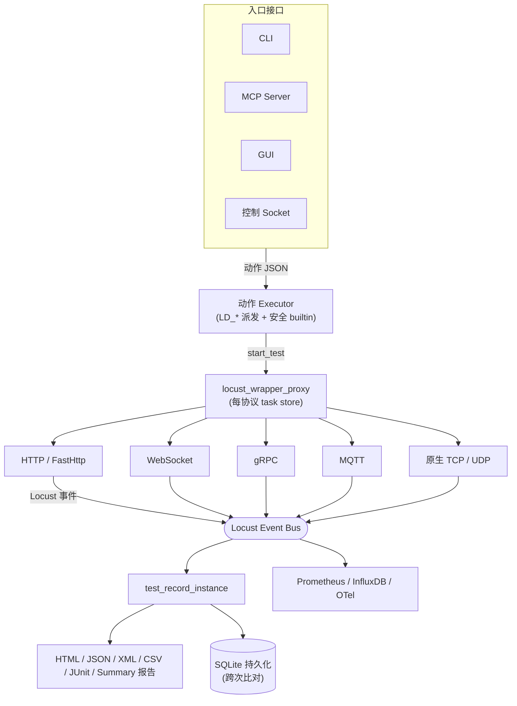

# LoadDensity

<p align="center">
  <strong>多协议压力与负载自动化框架：Locust + WebSocket + gRPC + MQTT + 原生 socket，搭配内建电池的 JSON 动作执行器。</strong>
</p>

<p align="center">
  <a href="https://pypi.org/project/je-load-density/"></a>
  <a href="https://pypi.org/project/je-load-density/"></a>
  <a href="https://github.com/Integration-Automation/LoadDensity/blob/main/LICENSE"></a>
  <a href="https://loaddensity.readthedocs.io/en/latest/"></a>
</p>

<p align="center">
  <a href="../README.md">English</a> |
  <a href="README_zh-TW.md">繁體中文</a>
</p>

---

LoadDensity（`je_load_density`）从 Locust 封装起家，逐步扩展为完整的多协议负载框架：HTTP、FastHttp、WebSocket、gRPC、MQTT 与原生 TCP/UDP 等使用者模板，皆通过同一个 JSON 驱动的动作执行器；另含数据参数化、情境流程、报告、可观测性、分布式 runner、录制、持久化存储，以及让 Claude 端到端驱动测试的 MCP 控制接口。每个 executor 指令以 `LD_*` 命名、使用单一派发点，因此一份动作 JSON 可同时混用协议、exporter 与报告。

> **可选依赖、可选安装** — 每个协议驱动与 exporter 都以 `pip install je_load_density[<extra>]` 提供。仅做 HTTP 压测者运行期不受影响。

## 目录

- [亮点](#亮点)
- [安装](#安装)
- [架构](#架构)
- [Quick Start](#quick-start)
- [核心 API](#核心-api)
- [动作 Executor](#动作-executor)
- [使用者模板](#使用者模板)
- [参数解析器](#参数解析器)
- [情境模式](#情境模式)
- [断言与提取](#断言与提取)
- [报告](#报告)
- [可观测性](#可观测性)
- [分布式 Master / Worker](#分布式-master--worker)
- [HAR 录制／重放](#har-录制重放)
- [持久化记录（SQLite）](#持久化记录sqlite)
- [MCP Server（给 Claude）](#mcp-server给-claude)
- [硬化控制 Socket](#硬化控制-socket)
- [GUI](#gui)
- [CLI 用法](#cli-用法)
- [测试记录](#测试记录)
- [异常处理](#异常处理)
- [日志](#日志)
- [支持平台](#支持平台)
- [许可证](#许可证)

## 亮点

- **一个 executor，六种协议** — HTTP、FastHttp、WebSocket、gRPC、MQTT、原生 TCP/UDP，全部通过 `LD_start_test` 以 `user` 切换派发。
- **JSON 驱动** — 每支测试皆为动作 JSON 列表；可手写、由 HAR 导入产生、由 MCP 工具调度，或经控制 socket 传送。
- **参数解析器** — `${var.x}`、`${env.X}`、`${csv.source.col}`、`${faker.method}`，以及内置 `${uuid()}`、`${now()}`、`${randint(min,max)}` 等 helper；可从响应提取值，后续 task 再用。
- **情境流程** — 以 `sequence`（默认）／`weighted`／`conditional`（`run_if`、`skip_if`）声明 task 流程，无需动到 Python。
- **六种报告格式** — HTML、JSON、XML、CSV、JUnit XML，以及百分位摘要 JSON（总计、失败率、per-name p50/p90/p95/p99）。
- **三种 exporter** — Prometheus HTTP 端点、InfluxDB line-protocol UDP/HTTP sink、OpenTelemetry OTLP gRPC。
- **分布式 runner** — `runner_mode="master"` / `"worker"`，跨机压测使用同一份 start_test API。
- **HAR 录制／重放** — 将真实浏览流量转成可执行动作 JSON，含 regex include/exclude 过滤。
- **持久化记录** — 可选 SQLite sink，含 run／record／metadata schema，便于跨次回归检查。
- **MCP server** — `python -m je_load_density.mcp_server` 对外开 11 个工具，让 Claude 端到端驱动 LoadDensity。
- **硬化控制 socket** — Length-prefix framing、可选 TLS、共享密钥 token（环境变数或参数），同时保留与 PyBreeze 等工具兼容的 legacy 模式。
- **实时 GUI** — 可选的 PySide6 GUI 含实时统计面板（RPS、平均、p95、失败），翻译为英文、繁体中文、日文、韩文。
- **CLI 子命令** — `run` / `run-dir` / `run-str` / `init` / `serve`。旧式 `-e/-d/-c/--execute_str` 标志保留以维持下游工具兼容。

## 安装

```bash
pip install je_load_density
```

引入 [Locust](https://locust.io/) 与 `defusedxml`，仅此而已。

### 可选 extras

| Extra | 加入 |
|-------|------|
| `gui` | PySide6 + qt-material（图形界面） |
| `websocket` | `websocket-client`（WebSocket user 模板） |
| `grpc` | `grpcio` + `protobuf`（gRPC user 模板） |
| `mqtt` | `paho-mqtt`（MQTT user 模板） |
| `prometheus` | `prometheus-client`（Prometheus exporter） |
| `opentelemetry` | OpenTelemetry SDK + OTLP gRPC exporter |
| `metrics` | `prometheus` + `opentelemetry` 一次装 |
| `faker` | `Faker`（驱动 `${faker.method}` 占位符） |
| `mcp` | `mcp` SDK（驱动 MCP server） |
| `all` | 上列全部 |

```bash
pip install "je_load_density[gui]"
pip install "je_load_density[mqtt,grpc,websocket]"
pip install "je_load_density[metrics]"
pip install "je_load_density[mcp]"
pip install "je_load_density[all]"
```

### 开发安装

```bash
git clone https://github.com/Integration-Automation/LoadDensity.git
cd LoadDensity
pip install -e ".[all]"
pip install -r requirements.txt
```

## 架构



依赖方向永远是动作层 → Locust。

## Quick Start

### Python API

```python
from je_load_density import start_test

start_test(
    user_detail_dict={"user": "fast_http_user"},
    user_count=50, spawn_rate=10, test_time=30,
    variables={"base": "https://httpbin.org"},
    tasks=[
        {"method": "get",  "request_url": "${var.base}/get"},
        {"method": "post", "request_url": "${var.base}/post",
         "json": {"hello": "world"},
         "assertions": [{"type": "status_code", "value": 200}]},
    ],
)
```

### 动作 JSON

```json
{"load_density": [
  ["LD_register_variables", {"variables": {"base": "https://httpbin.org"}}],
  ["LD_start_test", {
    "user_detail_dict": {"user": "fast_http_user"},
    "user_count": 20, "spawn_rate": 10, "test_time": 30,
    "tasks": [
      {"method": "get",  "request_url": "${var.base}/get"},
      {"method": "post", "request_url": "${var.base}/post",
       "json": {"hello": "world"}}
    ]
  }],
  ["LD_generate_summary_report", {"report_name": "smoke"}]
]}
```

CLI 执行：

```bash
python -m je_load_density run smoke.json
```

## 核心 API

完整公开接口见 `je_load_density/__init__.py` 的 `__all__`。

```python
from je_load_density import (
    start_test, prepare_env, create_env,
    execute_action, execute_files, executor, add_command_to_executor,
    test_record_instance, locust_wrapper_proxy,
    register_variable, register_variables,
    register_csv_source, register_csv_sources,
    parameter_resolver, resolve,
    har_to_action_json, har_to_tasks, load_har,
    persist_records, list_runs, fetch_run_records,
    start_prometheus_exporter, stop_prometheus_exporter,
    start_influxdb_sink, stop_influxdb_sink,
    start_opentelemetry_exporter, stop_opentelemetry_exporter,
    start_load_density_socket_server,
    generate_html_report, generate_json_report, generate_xml_report,
    generate_csv_report, generate_junit_report, generate_summary_report,
    build_summary,
    create_project_dir, callback_executor, read_action_json,
)
```

## 动作 Executor

每个动作为列表：

```python
["command_name"]                        # 无参数
["command_name", {"key": "value"}]      # 关键字参数
["command_name", [arg1, arg2]]          # 位置参数
```

最上层为裸列表，或 `{"load_density": [...]}` 包装。

### 内置 `LD_*` 指令

| 群组 | 指令 |
|------|------|
| 核心 | `LD_start_test`、`LD_execute_action`、`LD_execute_files`、`LD_add_package_to_executor`、`LD_start_socket_server` |
| 报告 | `LD_generate_html(_report)`、`LD_generate_json(_report)`、`LD_generate_xml(_report)`、`LD_generate_csv_report`、`LD_generate_junit_report`、`LD_generate_summary_report`、`LD_summary` |
| 持久化 | `LD_persist_records`、`LD_list_runs`、`LD_fetch_run_records`、`LD_clear_records` |
| 参数 | `LD_register_variable(s)`、`LD_register_csv_source(s)`、`LD_clear_resolver` |
| 录制 | `LD_load_har`、`LD_har_to_tasks`、`LD_har_to_action_json` |
| 指标 | `LD_start/stop_prometheus_exporter`、`LD_start/stop_influxdb_sink`、`LD_start/stop_opentelemetry_exporter` |

安全的 Python builtin（`print`、`len`、`range` 等）也可使用；`eval`、`exec`、`compile`、`__import__`、`breakpoint`、`open`、`input` 已被明确封锁。

### 自定义指令

```python
from je_load_density import add_command_to_executor

def slack_notify(message: str) -> None:
    ...

add_command_to_executor({"LD_slack_notify": slack_notify})
```

## 使用者模板

所有模板皆通过 `start_test` 的 `user_detail_dict={"user": "<key>"}` 注册；HTTP / WebSocket / gRPC / MQTT / raw socket 共用相同 task 结构，仅协议相关字段不同。

### HTTP / FastHttp

```python
start_test(
    user_detail_dict={"user": "fast_http_user"},
    user_count=50, spawn_rate=10, test_time=60,
    variables={"base": "https://api.example.com"},
    tasks=[
        {"method": "post", "request_url": "${var.base}/login",
         "json": {"email": "u@example.com", "password": "secret"},
         "extract": [{"var": "auth", "from": "json_path", "path": "data.token"}]},
        {"method": "get", "request_url": "${var.base}/profile",
         "headers": {"Authorization": "Bearer ${var.auth}"},
         "assertions": [{"type": "status_code", "value": 200}]},
    ],
)
```

### WebSocket

```python
start_test(
    user_detail_dict={"user": "websocket_user"},
    user_count=10, spawn_rate=5, test_time=60,
    tasks=[
        {"method": "connect", "request_url": "wss://echo.example.com/socket"},
        {"method": "sendrecv", "payload": '{"ping": 1}', "expect": "pong"},
        {"method": "close"},
    ],
)
```

### gRPC

```python
start_test(
    user_detail_dict={"user": "grpc_user"},
    user_count=20, spawn_rate=5, test_time=60,
    tasks=[{
        "name": "say_hello",
        "target": "localhost:50051",
        "stub_path": "pkg.greeter_pb2_grpc.GreeterStub",
        "request_path": "pkg.greeter_pb2.HelloRequest",
        "method": "SayHello",
        "payload": {"name": "world"},
        "metadata": [["x-token", "abc"]],
        "timeout": 5,
    }],
)
```

`stub_path` 与 `request_path` 在 `importlib.import_module` 之前皆通过严格标识符 regex 验证，traversal 攻击将被拒绝。

### MQTT

```python
start_test(
    user_detail_dict={"user": "mqtt_user"},
    user_count=10, spawn_rate=5, test_time=60,
    tasks=[
        {"method": "connect",   "broker": "127.0.0.1:1883"},
        {"method": "subscribe", "topic":  "telemetry/in", "qos": 1},
        {"method": "publish",   "topic":  "telemetry/out", "payload": "ping", "qos": 1},
        {"method": "disconnect"},
    ],
)
```

### 原生 TCP / UDP

仅用标准库，无需安装。

```python
start_test(
    user_detail_dict={"user": "socket_user"},
    user_count=20, spawn_rate=5, test_time=60,
    tasks=[
        {"protocol": "tcp", "target": "127.0.0.1:9000",
         "payload": "PING\n", "expect_bytes": 64,
         "expect_substring": "PONG"},
        {"protocol": "udp", "target": "127.0.0.1:9000",
         "payload": "hex:DEADBEEF", "expect_bytes": 4},
    ],
)
```

## 参数解析器

| 占位符 | 解析为 |
|--------|--------|
| `${var.NAME}` | `register_variable(s)` 设定的值 |
| `${env.NAME}` | 环境变量 `NAME` |
| `${csv.SOURCE.COL}` | CSV 来源 `SOURCE` 的下一行（默认循环） |
| `${faker.METHOD}` | `Faker().METHOD()`（lazy import） |
| `${uuid()}` | 新 UUID 4 字串 |
| `${now()}` | 本地 ISO-8601 时间（秒） |
| `${randint(min, max)}` | 密码学强度随机整数 |

未知占位符原样保留，便于 dry run 调试。

## 情境模式

```json
{
  "mode": "weighted",
  "tasks": [
    {"method": "get", "request_url": "/products", "weight": 3},
    {"method": "get", "request_url": "/expensive", "weight": 1}
  ]
}
```

| 模式 | 行为 |
|------|------|
| `sequence` | 依序执行所有 task（默认） |
| `weighted` | 每 tick 依 `weight` 加权挑一个 |
| `conditional` | 以 `run_if` / `skip_if` 谓词控制 |

谓词：`bool`、`"${var.x}"`、`{"equals": [a,b]}`、`{"not_equals": [a,b]}`、`{"in": [needle, haystack]}`、`{"truthy": value}`。

## 断言与提取

```json
{
  "method": "post",
  "request_url": "${var.base}/login",
  "json": {"email": "u@example.com", "password": "secret"},
  "assertions": [
    {"type": "status_code", "value": 200},
    {"type": "json_path", "path": "data.role", "value": "admin"}
  ],
  "extract": [
    {"var": "auth_token", "from": "json_path", "path": "data.token"},
    {"var": "request_id", "from": "header",    "name": "X-Request-Id"}
  ]
}
```

断言类型：`status_code`、`contains`、`not_contains`、`json_path`、`header`。
提取来源：`json_path`、`header`、`status_code`。

## 报告

```python
from je_load_density import (
    generate_html_report, generate_json_report, generate_xml_report,
    generate_csv_report, generate_junit_report, generate_summary_report,
)

generate_html_report("report")           # report.html
generate_json_report("report")           # report_success.json + report_failure.json
generate_xml_report("report")            # report_success.xml  + report_failure.xml
generate_csv_report("report")            # report.csv
generate_junit_report("report-junit")    # report-junit.xml（CI）
generate_summary_report("report-sum")    # 总计 + per-name p50/p90/p95/p99
```

## 可观测性

```python
from je_load_density import (
    start_prometheus_exporter, start_influxdb_sink, start_opentelemetry_exporter,
)

start_prometheus_exporter(port=9646, addr="127.0.0.1")
start_influxdb_sink(transport="udp", host="influxdb", port=8089)
start_opentelemetry_exporter(endpoint="http://otel-collector:4317",
                             service_name="loaddensity")
```

| Sink | 指标 |
|------|------|
| Prometheus | `loaddensity_requests_total`、`loaddensity_request_latency_ms`、`loaddensity_response_bytes` |
| InfluxDB | `loaddensity_request` line-protocol（UDP 或 HTTP） |
| OTel | `loaddensity.requests`、`loaddensity.request.latency`、`loaddensity.response.size` |

三者皆 lazy load，由对应 install extra 控管依赖。

## 分布式 Master / Worker

```python
# master
start_test(
    user_detail_dict={"user": "fast_http_user"},
    runner_mode="master",
    master_bind_host="0.0.0.0", master_bind_port=5557,
    expected_workers=4,
    web_ui_dict={"host": "0.0.0.0", "port": 8089},
    user_count=400, spawn_rate=40, test_time=600,
    tasks=[...],
)

# worker
start_test(
    user_detail_dict={"user": "fast_http_user"},
    runner_mode="worker",
    master_host="10.0.0.10", master_port=5557,
    tasks=[...],
)
```

Master 在开始 ramp 前最多等 60 秒，等待 `expected_workers` 个 worker 加入。

## HAR 录制／重放

```python
from je_load_density import load_har, har_to_action_json

har = load_har("recording.har")
action_json = har_to_action_json(
    har,
    user="fast_http_user",
    user_count=20, spawn_rate=10, test_time=120,
    include=[r"api\.example\.com"],
    exclude=[r"\.svg$"],
)
```

可吃 Chrome / Firefox DevTools、mitmproxy、Charles 等录制。状态码会转成 `status_code` 断言。

## 持久化记录（SQLite）

```python
from je_load_density import persist_records, list_runs, fetch_run_records

run_id = persist_records(
    "loadtests.db",
    label="checkout-2026-04-28",
    metadata={"branch": "dev", "commit": "abc1234"},
)
for row in list_runs("loadtests.db", limit=10):
    print(row)
```

Schema 采延迟建立。`run_id` 与 `name` 上有索引，跨次查询快速。

## MCP Server（给 Claude）

```bash
pip install "je_load_density[mcp]"
python -m je_load_density.mcp_server
```

接到 Claude Desktop / Code：

```json
{
  "mcpServers": {
    "loaddensity": {
      "command": "python",
      "args": ["-m", "je_load_density.mcp_server"]
    }
  }
}
```

对外开 11 个工具：`run_test`、`run_action_json`、`create_project`、`list_executor_commands`、`import_har`、`generate_reports`、`summary`、`persist_records`、`list_runs`、`fetch_run`、`clear_records`。

## 硬化控制 Socket

```bash
python -m je_load_density serve \
    --host 0.0.0.0 --port 9940 --framed \
    --token "$LOAD_DENSITY_SOCKET_TOKEN" \
    --tls-cert /etc/loaddensity/server.crt \
    --tls-key /etc/loaddensity/server.key
```

- 4-byte big-endian 长度前缀框架（1 MiB 上限）
- 可选 TLS（`ssl.create_default_context`，TLS 1.2+ minimum）
- 共享密钥 token，以 `hmac.compare_digest` 比对；一旦设定，所有 payload 须使用 `{"token": "...", "command": [...]}` 信封，可以 `"op": "quit"` 停机
- Token 也可由 `LOAD_DENSITY_SOCKET_TOKEN` 环境变数读取
- 保留未验证 legacy 模式以维持兼容

## GUI

```bash
pip install "je_load_density[gui]"
```

```python
import sys
from PySide6.QtWidgets import QApplication
from je_load_density.gui.main_window import LoadDensityUI

app = QApplication(sys.argv)
window = LoadDensityUI()
window.show()
sys.exit(app.exec())
```

GUI 提供英文、繁体中文、日文、韩文翻译，以及每秒轮询 `test_record_instance` 的实时统计面板（RPS、平均、p95、失败）。

## CLI 用法

```
python -m je_load_density run FILE              # 执行单一动作 JSON 档
python -m je_load_density run-dir DIR           # 执行 DIR 下所有 .json
python -m je_load_density run-str JSON          # 执行 inline JSON
python -m je_load_density init PATH             # 建立专案骨架
python -m je_load_density serve [--host ...]    # 启动控制 socket
```

旧式 `-e/-d/-c/--execute_str` 仍接受，兼容下游工具。

## 测试记录

`test_record_instance.test_record_list` 与 `error_record_list` 收集每笔请求：`Method`、`test_url`、`name`、`status_code`、`response_time_ms`、`response_length`，失败则含 `error`。报告与 SQLite sink 直接读取此处。

## 异常处理

```
LoadDensityTestException
├── LoadDensityTestJsonException
├── LoadDensityGenerateJsonReportException
├── LoadDensityTestExecuteException
├── LoadDensityAssertException
├── LoadDensityHTMLException
├── LoadDensityAddCommandException
├── XMLException → XMLTypeException
└── CallbackExecutorException
```

所有自定义异常皆继承 `LoadDensityTestException`；拦该类别即可全面处理。

## 日志

LoadDensity 提供已配置好的 logger（`load_density_logger`，位于 `je_load_density.utils.logging.loggin_instance`）。以标准 `logging` 模组 API 即可整合现有日志系统。

## 支持平台

| 平台 | 状态 |
|------|------|
| Windows 10 / 11 | 完整支持 |
| macOS | 完整支持 |
| Ubuntu / Linux | 完整支持 |
| Raspberry Pi | 已测 3B+ 以上 |

需 Python 3.10+。

## 许可证

MIT — 见 [LICENSE](../LICENSE)。
