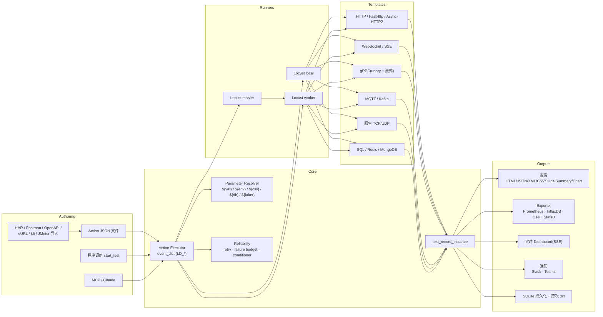
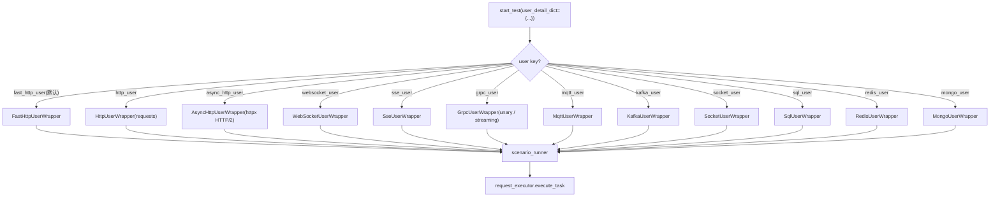

# LoadDensity

<p align="center">
  <strong>多协议压力与负载自动化框架:Locust + WebSocket + gRPC + MQTT + 原生 socket,搭配内置电池的 JSON 动作执行器。</strong>
</p>

<p align="center">
  <a href="https://pypi.org/project/je-load-density/"></a>
  <a href="https://pypi.org/project/je-load-density/"></a>
  <a href="https://github.com/Integration-Automation/LoadDensity/blob/main/LICENSE"></a>
  <a href="https://loaddensity.readthedocs.io/en/latest/"></a>
</p>

<p align="center">
  <a href="../README.md">English</a> |
  <a href="README_zh-TW.md">繁體中文</a>
</p>

---

LoadDensity(`je_load_density`)从 Locust 封装起步,逐步扩展为完整的多协议负载框架:HTTP、FastHttp、WebSocket、gRPC、MQTT、原生 TCP/UDP,再加上 SQL、Redis、Kafka、MongoDB、SSE、Async HTTP/2 等用户模板,皆通过同一个 JSON 驱动的动作执行器;并附带数据参数化、场景流程、报告、可观测性、分布式 runner、录制、持久化存储、可靠性(自适应重试 / 失败预算 / 网络条件)、实时 dashboard、Slack/Teams 通知、Auth(OAuth2 / JWT / AWS SigV4),以及让 Claude 端到端驱动测试的 MCP 控制面。每个 executor 命令以 `LD_*` 命名、走单一调度点,因此一份动作 JSON 可同时混用协议、exporter 与报告。

> **可选依赖、按需安装** — 每个协议驱动与 exporter 都通过 `pip install je_load_density[<extra>]` 提供。

## 目录

- [亮点](#亮点)
- [安装](#安装)
- [架构](#架构)
- [Quick Start](#quick-start)
- [食谱 (Recipes)](#食谱-recipes)
- [核心 API](#核心-api)
- [动作 Executor](#动作-executor)
- [用户模板](#用户模板)
- [参数解析器](#参数解析器)
- [场景模式](#场景模式)
- [断言与提取](#断言与提取)
- [报告](#报告)
- [可观测性](#可观测性)
- [分布式 Master / Worker](#分布式-master--worker)
- [HAR 录制/重放](#har-录制重放)
- [持久化记录(SQLite)](#持久化记录sqlite)
- [MCP Server(给 Claude)](#mcp-server给-claude)
- [硬化控制 Socket](#硬化控制-socket)
- [SLA Gate 与跨次回归 Diff](#sla-gate-与跨次回归-diff)
- [Load Shapes](#load-shapes)
- [Think Time 与 Throttle](#think-time-与-throttle)
- [导入器](#导入器)
- [Action JSON Linter / Schema / LSP](#action-json-linter--schema--lsp)
- [GitHub Actions 注释](#github-actions-注释)
- [可靠度](#可靠度)
- [实时 Dashboard](#实时-dashboard)
- [Slack / Teams / StatsD](#slack--teams--statsd)
- [Auth](#auth)
- [k6 / JMeter 导入器](#k6--jmeter-导入器)
- [GitHub Action 与 pre-commit](#github-action-与-pre-commit)
- [VS Code 扩展](#vs-code-扩展)
- [示例与本地实验环境](#示例与本地实验环境)
- [GUI](#gui)
- [CLI 用法](#cli-用法)
- [测试记录](#测试记录)
- [异常处理](#异常处理)
- [日志](#日志)
- [支持平台](#支持平台)
- [许可证](#许可证)

## 亮点

- **一个 executor,十二种 user template。** HTTP、FastHttp、**Async HTTP/2 (httpx)**、WebSocket、SSE、gRPC(unary 与 server/client/bidi 流式)、MQTT、原生 TCP/UDP、SQL(SQLAlchemy)、Redis、Kafka、**MongoDB** — 全部通过同一个 `LD_start_test` 以 `user_detail_dict["user"]` 切换调度。
- **动作 JSON 即契约。** 每个命令都由 `Executor.event_dict` 解析。
- **参数解析器处处可用。** `${var.NAME}`、`${env.NAME}`、`${csv.SOURCE.COL}`、`${db.SOURCE.COL}`、`${faker.method}` 及 `${uuid()}`、`${now()}`、`${randint(min,max)}`。
- **无需写 Python 的场景流程。** task 流程以 `sequence`(默认)、`weighted`、`conditional` 声明;per-task `think_time`、`throttle.rps`、`retry`(`{transient, flaky, permanent}` 预算)直接控制节奏与韧性。
- **内建 load shapes。** `load_shape="stages"|"spike"|"soak"` + JSON `shape_config`。
- **生产级别可靠度。** 自适应重试(指数退避 + 抖动 + 三级错误预算)、滑动窗口失败预算 / circuit breaker、process supervisor 与硬墙钟 watchdog、in-process 网络条件(latency / jitter / loss)。
- **SLA gate + 跨次回归 diff。** `LD_assert_sla` 让 CI 在 latency / failure_rate / requests 破线时失败;`LD_diff_runs` 比对两个 SQLite run 的 per-name 回归。
- **七种报告格式。** HTML、JSON、XML、CSV、JUnit XML、百分位摘要 JSON,另含可选 matplotlib **chart 报告**(`latency-over-time` + `RPS-over-time` PNG,需 `[charts]` extra)。
- **四种实时 exporter。** Prometheus HTTP 端点、InfluxDB line-protocol UDP/HTTP sink、OpenTelemetry OTLP gRPC、**Datadog DogStatsD UDP**,全部 lazy import 且由 install extra 控制。
- **实时 web dashboard。** `start_dashboard()` 启动 stdlib HTTP + SSE 服务器,将 RPS / avg / p95 / failure 实时推送到浏览器,含 per-name 表格。
- **Slack + Teams 通知。** `LD_post_slack_summary`(Block Kit)与 `LD_post_teams_summary`(MessageCard)。
- **断言与提取。** `status_code`、`contains`、`not_contains`、`json_path`、`header` 断言;提取来源 `json_path`/`header`/`status_code`。
- **分布式 runner。** `runner_mode="master"`/`"worker"`。
- **六种导入器。** HAR、Postman v2.1、OpenAPI 3.x、cURL、**k6 脚本**、**JMeter JMX** — 均可转成 action JSON 或单个 task。
- **Auth 工具。** stdlib OAuth2 client(`client_credentials` / `password` / `refresh` 含 token cache)、JWT 签发(HS256/384/512 + RS256/384/512)、AWS SigV4 签章;所有 HTTP user template 透过 `task["cert"]` 即可走 mTLS。
- **持久化记录。** 可选 SQLite sink,含 `runs`/`records`/`metadata` schema 并建立索引。
- **MCP server。** `python -m je_load_density.mcp_server` 对外暴露 13 个工具。
- **Action JSON 工具链。** linter、JSON Schema 导出、GitHub Actions 注释、stdlib LSP server、composite **GitHub Action** 包装、**pre-commit hook**、**VS Code 扩展** 骨架 — 编辑器 + CI 端到端覆盖。
- **硬化控制 socket。** 4 字节大端长度前缀 framing(上限 1 MiB)、可选 TLS、共享密钥 token,并保留 legacy 模式。
- **安全 executor。** `eval`、`exec`、`compile`、`__import__`、`breakpoint`、`open`、`input` 一律封锁。
- **实时 GUI。** 可选 PySide6 GUI,内置 RPS/平均/p95/失败统计,翻译为英、繁中、日、韩。
- **CLI 子命令。** `run`/`run-dir`/`run-str`/`init`/`serve`,保留旧式单旗标形式以维持下游工具兼容。
- **跨平台。** Windows 10/11、macOS、Ubuntu/Linux、Raspberry Pi(3B+ 以上),Python 3.10+。

## 安装

```bash
pip install je_load_density
```

引入 [Locust](https://locust.io/) 与 `defusedxml`,仅此而已。

### 可选 extras

| Extra | 加入 |
|-------|------|
| `gui` | PySide6 + qt-material |
| `websocket` | `websocket-client` |
| `grpc` | `grpcio` + `protobuf` |
| `mqtt` | `paho-mqtt` |
| `redis` | `redis` |
| `kafka` | `kafka-python` |
| `sql` | `sqlalchemy`(SQL user 模板 + `${db.*}` 占位符) |
| `mongo` | `pymongo` |
| `http2` | `httpx[http2]`(Async HTTP/2 user 模板) |
| `auth` | `cryptography`(RS256/384/512 JWT 签发) |
| `reliability` | `psutil`(ProcessSupervisor) |
| `prometheus` | `prometheus-client` |
| `opentelemetry` | OpenTelemetry SDK + OTLP gRPC exporter |
| `metrics` | `prometheus` + `opentelemetry` 一起装 |
| `charts` | `matplotlib`(chart 报告) |
| `yaml` | `pyyaml`(OpenAPI YAML) |
| `faker` | `Faker` |
| `all` | 上述全部 |

```bash
pip install "je_load_density[all]"
```

### 开发安装

```bash
git clone https://github.com/Integration-Automation/LoadDensity.git
cd LoadDensity
pip install -e ".[all]"
pip install -r requirements.txt
```

硬性需求:Python **3.10+**、`locust`、`defusedxml`。

## 架构

### 系统总览


```mermaid
flowchart LR
  subgraph Authoring
    A1["Action JSON 文件"]
    A2["程序调用 start_test"]
    A3["HAR / Postman / OpenAPI /<br/>cURL / k6 / JMeter 导入"]
    A4["MCP / Claude"]
  end

  subgraph Core
    EXE["Action Executor<br/>event_dict (LD_*)"]
    RES["Parameter Resolver<br/>${var} / ${env} / ${csv} / ${db} / ${faker}"]
    REC["test_record_instance"]
    REL["Reliability<br/>retry · failure budget · conditioner"]
  end

  subgraph Runners
    LOC["Locust local"]
    MAS["Locust master"]
    WRK["Locust worker"]
  end

  subgraph Templates
    HTTP["HTTP / FastHttp / Async-HTTP2"]
    WS["WebSocket / SSE"]
    GRPC["gRPC(unary + 流式)"]
    MQ["MQTT / Kafka"]
    SOCK["原生 TCP/UDP"]
    DATA["SQL / Redis / MongoDB"]
  end

  subgraph Outputs
    REP["报告<br/>HTML/JSON/XML/CSV/JUnit/Summary/Chart"]
    EXP["Exporter<br/>Prometheus · InfluxDB · OTel · StatsD"]
    DASH["实时 Dashboard(SSE)"]
    NOT["通知<br/>Slack · Teams"]
    SQL["SQLite 持久化 + 跨次 diff"]
  end

  A1 --> EXE
  A2 --> EXE
  A3 --> A1
  A4 --> EXE
  EXE --> RES
  EXE --> REL
  EXE --> LOC
  EXE --> MAS
  EXE --> WRK
  LOC --> HTTP & WS & GRPC & MQ & SOCK & DATA
  MAS --> WRK
  WRK --> HTTP & WS & GRPC & MQ & SOCK & DATA
  HTTP & WS & GRPC & MQ & SOCK & DATA --> REC
  REC --> REP & EXP & DASH & NOT & SQL
```

### 动作生命周期


```mermaid
flowchart LR
  IN["Action [cmd, args]"] --> DISP["event_dict[cmd]"]
  DISP -- "LD_start_test" --> SEED["填入 resolver"]
  SEED --> PICK["选择 user 模板"]
  PICK --> ENV["prepare_env(local/master/worker · load_shape)"]
  ENV --> RUN["Locust runner tick"]
  RUN --> THR["throttle.rps 限流"]
  THR --> COND["network conditioner"]
  COND --> EXPAND["展开 ${...}"]
  EXPAND --> RETRY["per-task retry policy"]
  RETRY --> EXEC["execute_task"]
  EXEC -- 响应 --> ASSERT["assertions + extractors"]
  ASSERT --> EVT["Locust request 事件"]
  EVT --> REC["test_record_instance.append"]
  EVT --> FB["failure_budget · 超标即 trip"]
```

### User 调度


```mermaid
flowchart TB
  CMD["start_test(user_detail_dict={...})"] --> KEY{"user key?"}
  KEY -- "fast_http_user(默认)" --> FH["FastHttpUserWrapper"]
  KEY -- "http_user" --> H["HttpUserWrapper(requests)"]
  KEY -- "async_http_user" --> AH["AsyncHttpUserWrapper(httpx HTTP/2)"]
  KEY -- "websocket_user" --> WS["WebSocketUserWrapper"]
  KEY -- "sse_user" --> SS["SseUserWrapper"]
  KEY -- "grpc_user" --> G["GrpcUserWrapper(unary / streaming)"]
  KEY -- "mqtt_user" --> M["MqttUserWrapper"]
  KEY -- "kafka_user" --> K["KafkaUserWrapper"]
  KEY -- "socket_user" --> S["SocketUserWrapper"]
  KEY -- "sql_user" --> SQ["SqlUserWrapper"]
  KEY -- "redis_user" --> R["RedisUserWrapper"]
  KEY -- "mongo_user" --> MO["MongoUserWrapper"]
  FH & H & AH & WS & SS & G & M & K & S & SQ & R & MO --> SC["scenario_runner"]
  SC --> RX["request_executor.execute_task"]
```

### 模块地图

参见英文 README 的 *Module map* 章节(中文翻译版结构相同,新增的子模块包括 `utils/auth/`、`utils/dashboard/`、`utils/notifier/`、`utils/reliability/`、`utils/throttle/`、`utils/load_shapes/`、`utils/sla/`、`utils/regression/`、`utils/graphql/`、`utils/linter/`、`utils/schema/`、`utils/ci_annotations/`、`utils/recording/{k6,jmeter}_importer.py`、`action_lsp/`、`tools/`,以及 `editors/vscode/`、`docker/`、`examples/`、`action.yml`、`.pre-commit-hooks.yaml`)。

## Quick Start

### 用 Python 跑 HTTP 压测

```python
from je_load_density import start_test

start_test(
    user_detail_dict={"user": "fast_http_user"},
    user_count=50, spawn_rate=10, test_time=30,
    variables={"base": "https://httpbin.org"},
    tasks=[
        {"method": "get",  "request_url": "${var.base}/get"},
        {"method": "post", "request_url": "${var.base}/post",
         "json": {"hello": "world"},
         "assertions": [{"type": "status_code", "value": 200}]},
    ],
)
```

### Action JSON

```json
{"load_density": [
  ["LD_register_variables", {"variables": {"base": "https://httpbin.org"}}],
  ["LD_start_test", {
    "user_detail_dict": {"user": "fast_http_user"},
    "user_count": 20, "spawn_rate": 10, "test_time": 30,
    "tasks": [{"method": "get", "request_url": "${var.base}/get"}]
  }],
  ["LD_generate_summary_report", {"report_name": "smoke"}]
]}
```

```bash
python -m je_load_density run smoke.json
```

## 食谱 (Recipes)

| 食谱 | 展示 |
|---|---|
| HTTP smoke | `fast_http_user` + `status_code` 断言 + summary 报告 |
| 登录流程 | `extract` 取 token,后续 task 用 `${var.auth}` 带 header |
| 加权混合 | `mode: "weighted"` + `weight` |
| WebSocket echo | `websocket_user` `connect → sendrecv → close` |
| gRPC unary / 流式 | `grpc_user` 配 `rpc: "server_stream"` 等 |
| MQTT pub/sub | `mqtt_user` `connect → subscribe → publish → disconnect` |
| 原生 TCP/UDP | `socket_user` 带 `payload` 与 `expect_substring` |
| SQL / Redis / Mongo | 三种数据层 user template |
| Async HTTP/2 | `async_http_user` + `http2=True` |
| 分布式跑法 | master + N worker |
| HAR / Postman / OpenAPI / k6 / JMeter | 对应 `LD_*_to_action_json` |
| 导出指标 | Prometheus / InfluxDB / OTel / DogStatsD |
| 持久化结果 | `LD_persist_records` → SQLite → `LD_diff_runs` |
| SLA gate | `LD_assert_sla` |
| Spike shape | `load_shape="spike"` + `shape_config` |
| Think time + throttle | `task["think_time"]` 与 `task["throttle"]` |
| 可靠度 | `LD_install_failure_budget` + per-task `retry` |
| 实时 Dashboard | `LD_start_dashboard` |
| Slack / Teams | `LD_post_slack_summary` / `LD_post_teams_summary` |
| OAuth2 / JWT / AWS SigV4 | `OAuth2Client` · `sign_jwt` · `sign_aws_request` |
| mTLS | task 加 `"cert"` |
| MCP 驱动 | Claude 连 `python -m je_load_density.mcp_server` |

## 核心 API

公开接口共 108 条,定义于 `je_load_density/__init__.py` 的 `__all__`。完整列表请参见英文 README;以下为按主题分组的概览:

* **执行 / 配置:** `start_test`, `prepare_env`, `execute_action`, `execute_files`, `executor`, `add_command_to_executor`
* **参数解析:** `register_variable(s)`, `register_csv_source(s)`, `register_db_source(s)`, `resolve`, `parameter_resolver`
* **报告 / 持久化:** `generate_*_report`, `build_summary`, `persist_records`, `list_runs`, `fetch_run_records`, `diff_runs`
* **导入器:** `har_*`, `postman_*`, `openapi_*`, `curl_to_task`, `k6_script_*`, `jmeter_*`
* **场景:** `evaluate_sla` / `assert_sla`, `SoakShape` / `SpikeShape` / `StagesShape` / `build_load_shape`, `RpsThrottle`
* **可靠度:** `AdaptiveRetryPolicy`, `run_with_retry`, `FailureBudget`, `install_failure_budget`, `NetworkConditioner`, `install_network_conditioner`, `ProcessSupervisor`, `with_watchdog`
* **Exporter / Dashboard / 通知:** `start_*_exporter`, `start_statsd_sink`, `start_dashboard`, `snapshot_metrics`, `post_slack_summary`, `post_teams_summary`
* **Auth:** `OAuth2Client`, `fetch_*_token`, `refresh_token`, `sign_jwt`, `decode_jwt`, `sign_aws_request`
* **工具:** `lint_action(_file)`, `action_json_schema`, `export_schema`, `emit_github_annotations`, `graphql_to_http_task`

## 动作 Executor

| 类别 | 命令 |
|------|------|
| 核心 | `LD_start_test`、`LD_execute_action`、`LD_execute_files`、`LD_add_package_to_executor`、`LD_start_socket_server` |
| 报告 | `LD_generate_*` + `LD_summary` |
| 持久化 | `LD_persist_records`、`LD_list_runs`、`LD_fetch_run_records`、`LD_clear_records` |
| 参数 | `LD_register_variable(s)`、`LD_register_csv_source(s)`、`LD_register_db_source(s)`、`LD_clear_resolver` |
| 录制 / 导入 | `LD_load_har`、`LD_har_to_*`、`LD_postman_to_*`、`LD_openapi_to_*`、`LD_curl_to_task`、`LD_k6_script_to_*`、`LD_jmeter_to_*` |
| 指标 | `LD_start/stop_prometheus_exporter`、`LD_start/stop_influxdb_sink`、`LD_start/stop_opentelemetry_exporter`、`LD_start/stop_statsd_sink` |
| 质量 / DX | `LD_lint_action(_file)`、`LD_export_schema`、`LD_emit_github_annotations` |
| SLA / 回归 | `LD_evaluate_sla`、`LD_assert_sla`、`LD_diff_runs` |
| 可靠度 | `LD_install/uninstall_failure_budget`、`LD_install/uninstall_network_conditioner` |
| Dashboard / 通知 | `LD_start/stop_dashboard`、`LD_post_slack_summary`、`LD_post_teams_summary` |

## 用户模板

参见英文 README,12 个 user template 共用同一份 task schema;新增项包括 `async_http_user`(httpx,可开 HTTP/2)、`sse_user`、`sql_user`、`redis_user`、`kafka_user`、`mongo_user`,以及 gRPC streaming(`rpc: "server_stream"` / `"client_stream"` / `"bidi"`)和 mTLS(task 内加 `"cert"`)。

## 参数解析器

| 占位符 | 解析为 |
|--------|--------|
| `${var.NAME}` | `register_variable(s)` 传入的值 |
| `${env.NAME}` | 环境变量 |
| `${csv.SOURCE.COL}` | CSV 源的下一行 |
| `${db.SOURCE.COL}` | SQLAlchemy 查询结果的下一行 |
| `${faker.METHOD}` | `Faker().METHOD()` |
| `${uuid()}` | UUID 4 |
| `${now()}` | 本地 ISO-8601 时间戳 |
| `${randint(min, max)}` | 加密强度随机整数 |

## 场景模式

```json
{"mode": "weighted", "tasks": [
  {"method": "get", "request_url": "/products", "weight": 3},
  {"method": "get", "request_url": "/expensive", "weight": 1}
]}
```

| 模式 | 行为 |
|------|------|
| `sequence` | 每 tick 按序执行(默认) |
| `weighted` | 每 tick 按 `weight` 选一个 |
| `conditional` | 由 `run_if` / `skip_if` 求值 |

per-task 控制:`think_time`、`throttle.rps`、`retry.{transient,flaky,permanent,...}`。

## 断言与提取

断言类型:`status_code`、`contains`、`not_contains`、`json_path`、`header`。提取来源:`json_path`、`header`、`status_code`。

## 报告

| 格式 | 输出 |
|------|------|
| HTML | `<base>.html` |
| JSON | `<base>_success.json` + `<base>_failure.json` |
| XML | `<base>_success.xml` + `<base>_failure.xml` |
| CSV | `<base>.csv` |
| JUnit | `<base>-junit.xml` |
| Summary | `<base>.json`(per-name p50/p90/p95/p99) |
| Chart | `<base>-latency.png` + `<base>-rps.png`(`[charts]` extra) |

## 可观测性

```python
start_prometheus_exporter(port=9646)
start_influxdb_sink(transport="udp", host="influxdb", port=8089)
start_opentelemetry_exporter(endpoint="http://otel:4317", service_name="loaddensity")
start_statsd_sink(host="dogstatsd", port=8125, prefix="loaddensity")
```

## 分布式 Master / Worker

```python
start_test(user_detail_dict={"user": "fast_http_user"},
           runner_mode="master", expected_workers=4,
           user_count=400, spawn_rate=40, test_time=600, tasks=[...])

start_test(user_detail_dict={"user": "fast_http_user"},
           runner_mode="worker", master_host="10.0.0.10", master_port=5557,
           tasks=[...])
```

master 等待最多 60 秒让 `expected_workers` 完成注册后开始 ramp。

## HAR 录制/重放

```python
action_json = har_to_action_json(
    load_har("recording.har"),
    user="fast_http_user", user_count=20, spawn_rate=10, test_time=120,
    include=[r"api\.example\.com"], exclude=[r"\.svg$"],
)
```

## 持久化记录(SQLite)

```python
run_id = persist_records("loadtests.db", label="checkout-2026-05-26",
                          metadata={"branch": "dev"})

report = diff_runs("loadtests.db", baseline_run_id=42, current_run_id=run_id,
                    tolerance=0.10)
```

## MCP Server(给 Claude)

```bash
pip install je_load_density
python -m je_load_density.mcp_server
```

server 自己在 stdio 上讲 MCP(JSON-RPC 2.0,一行一条消息),不需要 `mcp` SDK;`[mcp]` extra 是空的,只为让旧的安装命令还能用。

对外暴露 13 个工具:`run_test`、`run_action_json`、`create_project`、`list_executor_commands`、`import_har`、`generate_reports`、`summary`、`persist_records`、`list_runs`、`fetch_run`、`clear_records`、`generate_from_openapi`、`generate_from_curls`。

## 硬化控制 Socket

```bash
python -m je_load_density serve --host 0.0.0.0 --port 9940 --framed \
    --token "$LOAD_DENSITY_SOCKET_TOKEN" \
    --tls-cert server.crt --tls-key server.key
```

4 字节大端长度前缀(上限 1 MiB)+ 可选 TLS + 共享密钥 token(`hmac.compare_digest`)+ 保留 legacy 模式。

## SLA Gate 与跨次回归 Diff

```python
from je_load_density import assert_sla, build_summary, diff_runs

assert_sla([
    {"type": "failure_rate", "value": 0.02},
    {"type": "latency_p95", "value": 800},
    {"type": "latency_p95", "name": "/checkout", "value": 500},
    {"type": "requests", "op": "gte", "value": 1000},
], summary=build_summary())

report = diff_runs("loadtests.db", baseline_run_id=42, current_run_id=43,
                    tolerance=0.10)
if report["has_regressions"]:
    raise SystemExit(report["regressions"])
```

## Load Shapes

```python
start_test(
    user_detail_dict={"user": "fast_http_user"},
    load_shape="spike",
    shape_config={"baseline_users": 20, "spike_users": 200,
                  "spawn_rate": 50, "pre_seconds": 30,
                  "spike_seconds": 30, "post_seconds": 30},
    tasks=[...],
)
```

## Think Time 与 Throttle

```json
[
  {"method": "get", "request_url": "${var.base}/home",
   "think_time": {"min": 0.5, "max": 1.5}},
  {"method": "get", "request_url": "${var.base}/checkout",
   "throttle": {"key": "checkout", "rps": 25, "burst": 5}}
]
```

## 导入器

```python
from je_load_density import (
    load_har, har_to_action_json,
    load_postman_collection, postman_to_action_json,
    load_openapi, openapi_to_action_json,
    curl_to_task,
    load_k6_script, k6_script_to_action_json,
    load_jmeter_jmx, jmeter_to_action_json,
)
```

OpenAPI 会把 `{param}` 路径参数转为 `${var.param}`;k6 把 `check()` 内的 `is 200` 解为 `status_code` 断言;JMeter 会继承同层 HeaderManager。

## Action JSON Linter / Schema / LSP

```python
findings = lint_action({"load_density": [["LD_typo"]]})
export_schema("docs/reference/loaddensity-action-schema.json")
```

```bash
python -m je_load_density.action_lsp   # 或: loaddensity-lsp
```

## GitHub Actions 注释

```python
emit_github_annotations(title="LoadDensity")
# ::error title=LoadDensity::GET /checkout (HTTP 500): timeout
```

## 可靠度

```python
from je_load_density import (
    AdaptiveRetryPolicy, run_with_retry,
    install_failure_budget, install_network_conditioner,
    with_watchdog,
)

policy = AdaptiveRetryPolicy(transient_budget=5, flaky_budget=2,
                              base_delay=0.1, max_delay=2.0)
run_with_retry(lambda: do_request(), policy=policy)

# task["retry"] = {"transient": 3, "flaky": 1, "base_delay": 0.2}

install_failure_budget(threshold=0.05, window_seconds=30,
                       runner_quit_callback=lambda: env.runner.quit())
install_network_conditioner(latency_ms=50, jitter_ms=20, loss_rate=0.01,
                             name_filter="/checkout")

with_watchdog(lambda: execute_action(action_json), timeout_seconds=600)
```

## 实时 Dashboard

```python
from je_load_density import start_dashboard
start_dashboard(host="127.0.0.1", port=8765, refresh_seconds=1.0)
# 浏览 http://127.0.0.1:8765,/events 走 SSE
```

## Slack / Teams / StatsD

```python
from je_load_density import (
    post_slack_summary, post_teams_summary, start_statsd_sink,
)

start_statsd_sink(host="dogstatsd", port=8125, prefix="loaddensity")
post_slack_summary("https://hooks.slack.com/services/...")
post_teams_summary("https://outlook.office.com/webhook/...")
```

## Auth

```python
from je_load_density import OAuth2Client, sign_jwt, sign_aws_request

client = OAuth2Client("https://idp/token", "id", "secret", scope="read:x")
token = client.get_client_credentials()

jwt = sign_jwt({"sub": "alice"}, secret="topsecret",
                algorithm="HS256", expires_in_seconds=300)

aws_headers = sign_aws_request(
    method="GET", url="https://s3.amazonaws.com/mybucket/key",
    region="us-east-1", service="s3", access_key="AK", secret_key="sk",
)
```

mTLS:

```json
{"method": "get", "request_url": "https://mtls.api/x",
 "cert": ["/etc/ssl/client.pem", "/etc/ssl/key.pem"]}
```

## k6 / JMeter 导入器

```python
action = k6_script_to_action_json(load_k6_script("script.js"))
action = jmeter_to_action_json(load_jmeter_jmx("plan.jmx"))
```

## GitHub Action 与 pre-commit

```yaml
# .github/workflows/load.yml
- uses: ./   # 或: Integration-Automation/LoadDensity@v1
  with:
    action-file: actions/smoke.json
    extras: "metrics,websocket"
    fail-on-error: "true"
```

```yaml
# .pre-commit-config.yaml
- repo: https://github.com/Integration-Automation/LoadDensity
  rev: v1.0.0
  hooks:
    - id: loaddensity-lint
```

## VS Code 扩展

`editors/vscode/` 内含最小扩展,以 stdio 启动 `python -m je_load_density.action_lsp` 提供 completion + diagnostics。`npm install && npm run package` 即可打包 `.vsix`。

## 示例与本地实验环境

* `examples/` 12 个可执行 recipe
* `docker/` 一键 `docker compose up -d` 启动 httpbin / mosquitto / redis / kafka / prometheus

## GUI

```bash
pip install "je_load_density[gui]"
```

```python
import sys
from PySide6.QtWidgets import QApplication
from je_load_density.gui.main_window import LoadDensityUI

app = QApplication(sys.argv)
window = LoadDensityUI()
window.show()
sys.exit(app.exec())
```

## CLI 用法

```
python -m je_load_density run FILE
python -m je_load_density run-dir DIR
python -m je_load_density run-str JSON
python -m je_load_density init PATH
python -m je_load_density serve [--host ...]
```

Console scripts:`loaddensity` / `loaddensity-mcp` / `loaddensity-lsp`。

## 测试记录

`test_record_instance.test_record_list` 与 `error_record_list` 收集每次请求,内含 `Method`、`test_url`、`name`、`status_code`、`response_time_ms`、`response_length`、`error`。报告、SQLite sink、SLA gate、Dashboard 都直接读取这些 list。

## 异常处理

```
LoadDensityTestException
├── LoadDensityTestJsonException
├── LoadDensityGenerateJsonReportException
├── LoadDensityTestExecuteException
├── LoadDensityAssertException
├── LoadDensityHTMLException
├── LoadDensityAddCommandException
├── XMLException → XMLTypeException
└── CallbackExecutorException

CircuitOpenError (utils/reliability/failure_budget.py)
```

## 日志

`load_density_logger` 位于 `je_load_density.utils.logging.loggin_instance`。

## 支持平台

| 平台 | 状态 |
|------|------|
| Windows 10 / 11 | 完整支持 |
| macOS | 完整支持 |
| Ubuntu / Linux | 完整支持 |
| Raspberry Pi | 已测 3B+ 以上 |

需要 Python 3.10+。

## 许可证

MIT — 详见 [LICENSE](../LICENSE)。

Copyright (c) 2022~2026 JE-Chen
