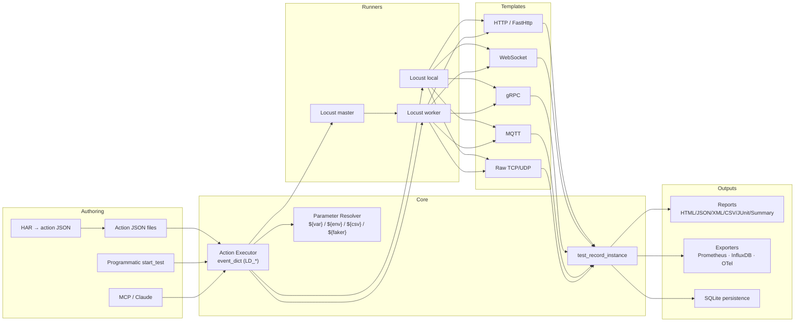
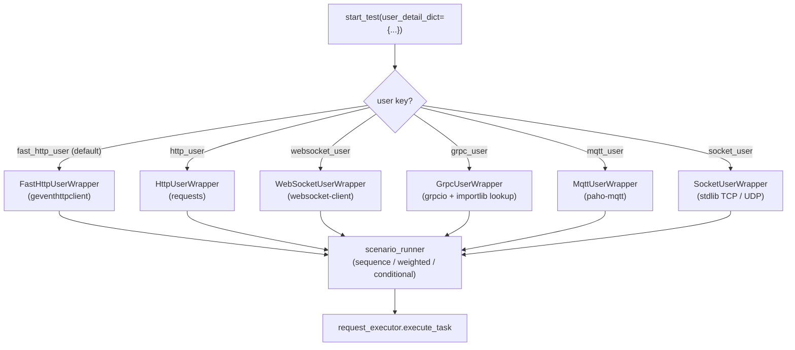

# LoadDensity

<p align="center">
  <strong>多协议压力与负载自动化框架:Locust + WebSocket + gRPC + MQTT + 原生 socket,搭配内置电池的 JSON 动作执行器。</strong>
</p>

<p align="center">
  <a href="https://pypi.org/project/je-load-density/"></a>
  <a href="https://pypi.org/project/je-load-density/"></a>
  <a href="https://github.com/Integration-Automation/LoadDensity/blob/main/LICENSE"></a>
  <a href="https://loaddensity.readthedocs.io/en/latest/"></a>
</p>

<p align="center">
  <a href="../README.md">English</a> |
  <a href="README_zh-TW.md">繁體中文</a>
</p>

---

LoadDensity(`je_load_density`)从 Locust 封装起步,逐步成长为完整的多协议负载框架:HTTP、FastHttp、WebSocket、gRPC、MQTT,以及原生 TCP/UDP 用户模板,全部收拢在同一个 JSON 驱动的动作执行器之后;此外还有参数化数据、场景流程、报告、可观测性、分布式 runner、录制、持久化存储,以及让 Claude 端到端驱动负载测试的 MCP 控制面等模块。每个 executor 命令都有确定性的名称(`LD_*`)与单一调度点,因此一份动作 JSON 可以在同一个脚本里混用协议、exporter 与报告。

> **可选依赖、按需安装** — 每个协议驱动与 exporter 都通过 `pip install je_load_density[<extra>]` 这个 extra 提供。对只需要 HTTP 负载测试的用户而言,基础安装的体积保持不变。

## 目录

- [亮点](#亮点)
- [安装](#安装)
- [架构](#架构)
  - [系统总览](#系统总览)
  - [动作生命周期](#动作生命周期)
  - [User 调度](#user-调度)
  - [模块地图](#模块地图)
- [Quick Start](#quick-start)
- [食谱 (Recipes)](#食谱-recipes)
- [核心 API](#核心-api)
- [动作 Executor](#动作-executor)
- [用户模板](#用户模板)
  - [HTTP / FastHttp](#http--fasthttp)
  - [WebSocket](#websocket)
  - [gRPC](#grpc)
  - [MQTT](#mqtt)
  - [原生 TCP / UDP](#原生-tcp--udp)
- [参数解析器](#参数解析器)
- [场景模式](#场景模式)
- [断言与提取](#断言与提取)
- [报告](#报告)
- [可观测性](#可观测性)
- [分布式 Master / Worker](#分布式-master--worker)
- [HAR 录制/重放](#har-录制重放)
- [持久化记录(SQLite)](#持久化记录sqlite)
- [MCP Server(给 Claude)](#mcp-server给-claude)
- [硬化控制 Socket](#硬化控制-socket)
- [SLA Gate 与跨次回归 Diff](#sla-gate-与跨次回归-diff)
- [Load Shapes](#load-shapes)
- [Think Time 与 Throttle](#think-time-与-throttle)
- [导入器](#导入器)
- [Action JSON Linter / Schema / LSP](#action-json-linter--schema--lsp)
- [GitHub Actions 注释](#github-actions-注释)
- [可靠度](#可靠度)
- [实时 Dashboard](#实时-dashboard)
- [Slack / Teams / StatsD](#slack--teams--statsd)
- [Auth](#auth)
- [k6 / JMeter 导入器](#k6--jmeter-导入器)
- [GitHub Action 与 pre-commit](#github-action-与-pre-commit)
- [VS Code 扩展](#vs-code-扩展)
- [示例与本地实验环境](#示例与本地实验环境)
- [GUI](#gui)
- [CLI 用法](#cli-用法)
- [测试记录](#测试记录)
- [异常处理](#异常处理)
- [日志](#日志)
- [支持平台](#支持平台)
- [更多模块](#更多模块)
- [许可证](#许可证)

## 亮点

- **一个 executor,41 种 user type。** HTTP、FastHttp、**Async HTTP/2 (httpx)**、HTTP/3、WebSocket、SSE、gRPC(unary 与 server/client/bidi 流式)、MQTT、原生 TCP/UDP、SQL(SQLAlchemy)、Redis、Kafka、**MongoDB**,以及更多协议(AMQP、NATS、Pulsar、Cassandra、Elasticsearch、Modbus、OPC-UA、LDAP、SNMP、SMTP/IMAP、FTP/SFTP 等)— 全部通过同一个 `LD_start_test` 命令,以 `user_detail_dict["user"]` 这个 key 调度。
- **动作 JSON 即契约。** 每个命令都经由 `Executor.event_dict` 解析;无论是手写、由 HAR 导入生成、通过控制 socket 发送,还是由 MCP 工具驱动,动作列表都是同一套。
- **参数解析器处处可用。** `${var.NAME}`、`${env.NAME}`、`${csv.SOURCE.COL}`、`${db.SOURCE.COL}`、`${faker.method}`,以及内置的 `${uuid()}`、`${now()}`、`${randint(min,max)}` 辅助函数;从某个响应提取的值,可以喂给下一个 task 的 URL、header、body 或断言。
- **无需 Python 的场景流程。** 把 task 声明成 `sequence`(默认)、`weighted` 或带 `run_if` / `skip_if` 谓词的 `conditional`;per-task 的 `think_time`、`throttle.rps` 与 `retry`(`{transient, flaky, permanent}` 预算)不必写等待循环就能控制节奏与韧性。
- **内置 load shapes。** `load_shape="stages"|"spike"|"soak"` 搭配 JSON `shape_config` — 不需要 Locust subclass。
- **生产级别的可靠度。** 自适应重试(指数退避 + 抖动 + 每种错误类别各自的预算)、滑动窗口失败预算 / circuit breaker、带硬性超时 watchdog 的 process supervisor、in-process 网络条件模拟(latency / jitter / loss)。
- **SLA gate + 回归 diff。** 当 latency / failure-rate / request-count 规则破线时,`LD_assert_sla` 会让 CI 失败;`LD_diff_runs` 比对两个持久化到 SQLite 的 run,并标出超过容忍范围的 per-name 回归。
- **七种报告格式。** HTML、JSON、XML、CSV、JUnit XML、百分位摘要 JSON,再加上可选的 matplotlib **chart 报告**(通过 `[charts]` extra 生成 `latency-over-time` 与 `RPS-over-time` PNG)。
- **四种实时 exporter。** Prometheus HTTP 端点、InfluxDB line-protocol UDP/HTTP sink、OpenTelemetry OTLP gRPC exporter、**Datadog DogStatsD UDP** sink — 全部延迟导入,并由对应的安装 extra 控制。
- **实时 web dashboard。** `start_dashboard()` 会启动一个 stdlib HTTP + SSE 服务器,把运行中的 RPS / avg / p95 / failure 计数流式推送到任意浏览器,并附上 per-name 表格。
- **Slack + Teams 通知。** 以 build_summary 的输出为基础的 Block Kit + MessageCard 摘要投递器(`LD_post_slack_summary`、`LD_post_teams_summary`)。
- **断言 + 提取。** `status_code`、`contains`、`not_contains`、`json_path`、`header` 断言在 Locust 的 `catch_response` 下执行;来源为 `json_path` / `header` / `status_code` 的提取器会把值写回参数解析器。
- **分布式 runner。** `runner_mode="master"` / `"worker"` 以同一套 `start_test` API 进行跨机负载;master 会先等待配置的 worker 数量最多 60 秒,再开始 ramp。
- **六种导入器。** HAR(浏览器流量)、Postman v2.1 collection、OpenAPI 3.x spec、独立的 cURL 命令、**k6 脚本**,以及 **JMeter JMX** plan — 每一种都能转成动作 JSON 或一个可直接喂给 `LD_start_test` 的 task。
- **Auth 辅助工具。** stdlib OAuth2 client(`client_credentials` / `password` / `refresh`,含 token cache)、JWT 签名器(HS256/384/512 + RS256/384/512)、AWS SigV4 请求签名器,再加上每个 HTTP 用户模板都能通过 `task["cert"]` 支持 mTLS client-cert。
- **持久化记录。** 可选的 SQLite sink,采用 `runs` / `records` / `metadata` schema 并建立索引以便跨次回归检查;开箱即可对空文件运作。
- **MCP server。** `python -m je_load_density.mcp_server` 对外暴露 13 个工具,让 Claude(Desktop、Code、任何 MCP client)不必离开对话就能执行测试、管理项目并取回报告。
- **动作 JSON 工具链。** 内置 linter(`LD_lint_action`)、JSON Schema 导出器(`LD_export_schema`)、GitHub Actions 注释发送器(`LD_emit_github_annotations`)、stdlib LSP server(`python -m je_load_density.action_lsp`)、composite **GitHub Action** 包装(`action.yml`)、**pre-commit hook**,以及 **VS Code 扩展** 骨架 — 编辑器 + CI 集成端到端到位。
- **硬化控制 socket。** 4 字节大端长度前缀 framing(上限 1 MiB)、通过 `ssl.create_default_context` 的可选 TLS、以环境变量或参数提供的共享密钥 token,再加上一个与 PyBreeze 等下游工具兼容的 legacy 模式。
- **安全 executor。** 动作 JSON 文件只能调用 `LD_*` 命令,以及一份 22 个名称的内置白名单(`print`、`len`、`sorted`、`sum` 等),此外别无其他。名单外的一切 — `eval`、`exec`、`compile`、`__import__`、`open`、`input`,以及 `getattr` / `setattr` / `vars` / `globals` 这些属性与作用域内置 — 根本没有注册,因此无法被调度。
- **实时 GUI。** 可选的 PySide6 前端,附带实时统计面板(RPS / avg / p95 / failures),已翻译为英文、繁体中文、日文与韩文。
- **CLI 子命令。** `run` / `run-dir` / `run-str` / `init` / `bench` / `shell` / `serve`。旧式单旗标形式(`-e/-d/-c/--execute_str`)仍为下游工具保留。
- **跨平台。** Windows 10/11、macOS、Ubuntu/Linux、Raspberry Pi(3B+ 以上),Python 3.10+。

## 安装

**稳定版:**

```bash
pip install je_load_density
```

引入 [Locust](https://locust.io/) 与 `defusedxml`,别无其他。

### 可选 extras

只安装你会用到的切片:

| Extra | 加入 |
|-------|------|
| `gui` | PySide6 + qt-material(图形前端) |
| `websocket` | `websocket-client`(WebSocket 用户模板) |
| `grpc` | `grpcio` + `protobuf`(gRPC 用户模板) |
| `mqtt` | `paho-mqtt`(MQTT 用户模板) |
| `redis` | `redis`(Redis 用户模板) |
| `kafka` | `kafka-python`(Kafka 用户模板) |
| `sql` | `sqlalchemy`(SQL 用户模板 + `${db.*}` 占位符) |
| `mongo` | `pymongo`(MongoDB 用户模板) |
| `http2` | `httpx[http2]`(Async HTTP/2 用户模板) |
| `auth` | `cryptography`(RS256/384/512 JWT 签名) |
| `reliability` | `psutil`(ProcessSupervisor) |
| `prometheus` | `prometheus-client`(Prometheus exporter) |
| `opentelemetry` | OpenTelemetry SDK + OTLP gRPC exporter |
| `metrics` | `prometheus` + `opentelemetry` 一次装齐 |
| `charts` | `matplotlib`(图表渲染报告) |
| `yaml` | `pyyaml`(OpenAPI YAML 加载) |
| `faker` | `Faker`(驱动 `${faker.method}` 占位符) |
| `all` | 上列全部 |

```bash
pip install "je_load_density[gui]"
pip install "je_load_density[mqtt,grpc,websocket]"
pip install "je_load_density[metrics]"
pip install "je_load_density[all]"
```

### 开发安装

```bash
git clone https://github.com/Integration-Automation/LoadDensity.git
cd LoadDensity
pip install -e ".[all]"
pip install -r requirements.txt
```

硬性需求:Python **3.10+**、`locust`、`defusedxml`。

## 架构

### 系统总览


```mermaid
flowchart LR
  subgraph Authoring
    A1["Action JSON files"]
    A2["Programmatic start_test"]
    A3["HAR → action JSON"]
    A4["MCP / Claude"]
  end

  subgraph Core
    EXE["Action Executor<br/>event_dict (LD_*)"]
    RES["Parameter Resolver<br/>${var} / ${env} / ${csv} / ${faker}"]
    REC["test_record_instance"]
  end

  subgraph Runners
    LOC["Locust local"]
    MAS["Locust master"]
    WRK["Locust worker"]
  end

  subgraph Templates
    HTTP["HTTP / FastHttp"]
    WS["WebSocket"]
    GRPC["gRPC"]
    MQTT["MQTT"]
    SOCK["Raw TCP/UDP"]
  end

  subgraph Outputs
    REP["Reports<br/>HTML/JSON/XML/CSV/JUnit/Summary"]
    EXP["Exporters<br/>Prometheus · InfluxDB · OTel"]
    SQL["SQLite persistence"]
  end

  A1 --> EXE
  A2 --> EXE
  A3 --> A1
  A4 --> EXE
  EXE --> RES
  EXE --> LOC
  EXE --> MAS
  EXE --> WRK
  LOC --> HTTP & WS & GRPC & MQTT & SOCK
  MAS --> WRK
  WRK --> HTTP & WS & GRPC & MQTT & SOCK
  HTTP & WS & GRPC & MQTT & SOCK --> REC
  REC --> REP
  REC --> EXP
  REC --> SQL
```

### 动作生命周期


```mermaid
flowchart LR
  IN["Action<br/>[cmd, args_or_kwargs]"] --> DISP["event_dict[cmd]"]
  DISP -- "LD_start_test" --> SEED["Seed resolver from<br/>variables / csv_sources"]
  SEED --> PICK["Pick user template<br/>(_USER_REGISTRY)"]
  PICK --> ENV["prepare_env<br/>(local / master / worker)"]
  ENV --> RUN["Locust runner ticks"]
  RUN --> EXPAND["Parameter resolver<br/>expands ${...} per task"]
  EXPAND --> EXEC["execute_task<br/>(per-protocol request)"]
  EXEC -- response --> ASSERT["assertions + extractors"]
  ASSERT --> EVT["Locust request event"]
  EVT --> REC["test_record_instance.append"]
  DISP -- "LD_generate_*_report" --> RREAD["Read from test_record_instance"]
  RREAD --> OUT["Report file(s)"]
```

### User 调度


```mermaid
flowchart TB
  CMD["start_test(user_detail_dict={...})"] --> KEY{"user key?"}
  KEY -- "fast_http_user (default)" --> FH["FastHttpUserWrapper<br/>(geventhttpclient)"]
  KEY -- "http_user" --> H["HttpUserWrapper<br/>(requests)"]
  KEY -- "websocket_user" --> WS["WebSocketUserWrapper<br/>(websocket-client)"]
  KEY -- "grpc_user" --> G["GrpcUserWrapper<br/>(grpcio + importlib lookup)"]
  KEY -- "mqtt_user" --> M["MqttUserWrapper<br/>(paho-mqtt)"]
  KEY -- "socket_user" --> S["SocketUserWrapper<br/>(stdlib TCP / UDP)"]
  FH & H & WS & G & M & S --> SC["scenario_runner<br/>(sequence / weighted / conditional)"]
  SC --> RX["request_executor.execute_task"]
```

### 模块地图

```
je_load_density/
├── __init__.py                       # Public API re-exports
├── __main__.py                       # CLI: run / run-dir / run-str / init / serve
├── gui/                              # Optional PySide6 front-end
│   ├── language_wrapper/             # En / zh-TW / Ja / Ko translations
│   ├── load_density_gui_thread.py    # Worker thread for non-blocking starts
│   ├── log_to_ui_filter.py           # Forward logger records to the UI pane
│   ├── main_widget.py                # Form-based test configurator
│   ├── main_window.py                # PySide6 main window shell
│   └── stats_panel.py                # Live RPS / avg / p95 / failures panel
├── mcp_server/                       # MCP server (13 tools for Claude)
│   ├── __main__.py
│   └── server.py
├── utils/
│   ├── callback/                     # callback_executor (post-action callbacks)
│   ├── exception/                    # LoadDensity* exception hierarchy + tags
│   ├── executor/                     # Executor class · event_dict · safe builtins
│   ├── file_process/                 # Directory walker · project scaffolder
│   ├── generate_report/              # HTML / JSON / XML / CSV / JUnit / Summary
│   ├── get_data_structure/           # API data helper (legacy)
│   ├── json/                         # JSON read/write · placeholder normaliser
│   ├── logging/                      # Configured load_density_logger
│   ├── metrics/                      # Prometheus · InfluxDB · OpenTelemetry sinks
│   ├── package_manager/              # Dynamic package loader (LD_add_package_*)
│   ├── parameterization/             # ParameterResolver + CSV / faker sources
│   ├── project/                      # Project template + create_project_dir
│   ├── recording/                    # HAR → action JSON converter
│   ├── socket_server/                # Length-framed TCP control plane (+TLS+token)
│   ├── test_record/                  # In-memory record list + SQLite persistence
│   └── xml/                          # defusedxml-backed XML helpers
└── wrapper/
    ├── create_locust_env/            # prepare_env / create_env (local/master/worker)
    ├── event/                        # request_hook (binds Locust events → records)
    ├── proxy/                        # Per-protocol task store (locust_wrapper_proxy)
    │   └── user/                     # fast_http / http / websocket / grpc / mqtt / socket
    ├── start_wrapper/                # start_test dispatcher (_USER_REGISTRY)
    └── user_template/                # Locust user classes + scenario_runner + request_executor
load_density_driver/                  # Standalone driver builds
test/                                 # pytest test suite
docs/                                 # Sphinx documentation (En / Zh / API)
```

## Quick Start

### 用 Python 跑 HTTP 负载测试

```python
from je_load_density import start_test

start_test(
    user_detail_dict={"user": "fast_http_user"},
    user_count=50,
    spawn_rate=10,
    test_time=30,
    variables={"base": "https://httpbin.org"},
    tasks=[
        {"method": "get",  "request_url": "${var.base}/get"},
        {"method": "post", "request_url": "${var.base}/post",
         "json": {"hello": "world"},
         "assertions": [{"type": "status_code", "value": 200}]},
    ],
)
```

### Action JSON

```json
{"load_density": [
  ["LD_register_variables", {"variables": {"base": "https://httpbin.org"}}],
  ["LD_start_test", {
    "user_detail_dict": {"user": "fast_http_user"},
    "user_count": 20, "spawn_rate": 10, "test_time": 30,
    "tasks": [
      {"method": "get",  "request_url": "${var.base}/get"},
      {"method": "post", "request_url": "${var.base}/post",
       "json": {"hello": "world"}}
    ]
  }],
  ["LD_generate_summary_report", {"report_name": "smoke"}]
]}
```

由 CLI 执行:

```bash
python -m je_load_density run smoke.json
```

### Action 形式

```python
["command"]                                    # no args
["command", {"key": "value"}]                  # kwargs
["command", [arg1, arg2]]                      # positional
```

最外层文档可以是一个纯 list,或一个 `{"load_density": [...]}` wrapper。

## 食谱 (Recipes)

覆盖最常见需求的简短复制粘贴片段。每一则都能以 Python 的 `start_test` 调用,或以 `LD_start_test` 动作执行。

| 食谱 | 展示 |
|---|---|
| **HTTP smoke** | `fast_http_user` + `status_code` 断言 + summary 报告。 |
| **登录流程** | 从登录响应 `extract` token,后续受保护的调用通过 `${var.auth}` header 重用。 |
| **加权混合** | `mode: "weighted"` 配合每个 task 的 `weight`,把流量偏向热门端点。 |
| **WebSocket echo** | `websocket_user` 的 `connect → sendrecv → close`,搭配 `expect` 子串断言。 |
| **gRPC unary** | `grpc_user` 配 `stub_path` / `request_path` + metadata tuple list + 每次调用的 timeout。 |
| **MQTT pub/sub** | `mqtt_user` 的 `connect → subscribe → publish → disconnect`,对本地 broker。 |
| **原生 TCP/UDP** | `socket_user` 带 `payload`(文本或 `hex:…`)与 `expect_substring`。 |
| **分布式跑法** | 一个 `runner_mode="master"` + N 个 `runner_mode="worker"` 进程,对同一份动作 JSON。 |
| **HAR replay** | `LD_load_har` → `LD_har_to_action_json`,含 regex include / exclude。 |
| **导出指标** | `LD_start_prometheus_exporter`、`LD_start_influxdb_sink`、`LD_start_opentelemetry_exporter`。 |
| **持久化结果** | `LD_persist_records` 带 `label` + `metadata` 存进 SQLite,再以 `LD_list_runs` 看趋势。 |
| **MCP 驱动** | 把 Claude 接到 `python -m je_load_density.mcp_server`,调用 `run_test` / `generate_reports`。 |
| **SLA gate** | `LD_assert_sla` 以 `latency_p95` / `failure_rate` 规则在回归时让 CI 失败。 |
| **Spike shape** | `load_shape="spike"` + `shape_config`,驱动 baseline → spike → baseline 的 ramp。 |
| **Think time + throttle** | `task["think_time"]` 与 `task["throttle"]={"rps":...}` 控制流量节奏。 |
| **Postman / OpenAPI / cURL** | `LD_postman_to_action_json` / `LD_openapi_to_action_json` / `LD_curl_to_task` 一次性导入。 |
| **Redis / Kafka / SQL** | 使用 `user_detail_dict={"user": "redis_user"}` 等,搭配协议专属的 task 字段。 |

把这张表和专属章节(见目录)对照,就能看到完整的参数面。

## 核心 API

```python
from je_load_density import (
    start_test, prepare_env, create_env,
    execute_action, execute_files, executor, add_command_to_executor,
    test_record_instance, locust_wrapper_proxy,
    register_variable, register_variables,
    register_csv_source, register_csv_sources,
    parameter_resolver, resolve,
    har_to_action_json, har_to_tasks, load_har,
    persist_records, list_runs, fetch_run_records,
    start_prometheus_exporter, stop_prometheus_exporter,
    start_influxdb_sink, stop_influxdb_sink,
    start_opentelemetry_exporter, stop_opentelemetry_exporter,
    start_load_density_socket_server,
    generate_html_report, generate_json_report, generate_xml_report,
    generate_csv_report, generate_junit_report, generate_summary_report,
    build_summary,
    create_project_dir, callback_executor, read_action_json,
)
```

完整的公开接口定义于 `je_load_density/__init__.py` 的 `__all__`。

## 动作 Executor

动作 executor 把字符串命令名称对应到一个 Python callable。每个后端、exporter 与报告 helper 都注册在 `event_dict` 之下。

### 内置 `LD_*` 命令

| 类别 | 命令 |
|-------|----------|
| 核心 | `LD_start_test`、`LD_execute_action`、`LD_execute_files`、`LD_add_package_to_executor`、`LD_start_socket_server` |
| 报告 | `LD_generate_html(_report)`、`LD_generate_json(_report)`、`LD_generate_xml(_report)`、`LD_generate_csv_report`、`LD_generate_junit_report`、`LD_generate_summary_report`、`LD_generate_chart_report`、`LD_summary` |
| 持久化 | `LD_persist_records`、`LD_list_runs`、`LD_fetch_run_records`、`LD_clear_records` |
| 参数 | `LD_register_variable(s)`、`LD_register_csv_source(s)`、`LD_register_db_source(s)`、`LD_clear_resolver` |
| 录制 | `LD_load_har`、`LD_har_to_*`、`LD_postman_to_*`、`LD_openapi_to_*`、`LD_curl_to_task`、`LD_k6_script_to_*`、`LD_jmeter_to_*` |
| 指标 | `LD_start/stop_prometheus_exporter`、`LD_start/stop_influxdb_sink`、`LD_start/stop_opentelemetry_exporter`、`LD_start/stop_statsd_sink` |
| 质量 / DX | `LD_lint_action`、`LD_lint_action_file`、`LD_export_schema`、`LD_emit_github_annotations` |
| SLA / 回归 | `LD_evaluate_sla`、`LD_assert_sla`、`LD_diff_runs` |
| 可靠度 | `LD_install_failure_budget`、`LD_uninstall_failure_budget`、`LD_install_network_conditioner`、`LD_uninstall_network_conditioner` |
| Dashboard / 通知 | `LD_start_dashboard`、`LD_stop_dashboard`、`LD_post_slack_summary`、`LD_post_teams_summary` |

安全的 Python 内置(`print`、`len`、`range` 等)也可接受;`eval`、`exec`、`compile`、`__import__`、`breakpoint`、`open`、`input` 则被明确封锁。

### 自定义命令

```python
from je_load_density import add_command_to_executor

def slack_notify(message: str) -> None:
    ...

add_command_to_executor({"LD_slack_notify": slack_notify})
```

## 用户模板

每个模板都通过 `user_detail_dict={"user": "<key>"}` 注册在 `start_test` 之下。task 在 HTTP、WebSocket、gRPC、MQTT 与原生 socket 用户之间共用相同的形状;只有协议专属的字段不同。

### HTTP / FastHttp

```python
start_test(
    user_detail_dict={"user": "fast_http_user"},
    user_count=50, spawn_rate=10, test_time=60,
    variables={"base": "https://api.example.com"},
    tasks=[
        {"method": "post", "request_url": "${var.base}/login",
         "json": {"email": "u@example.com", "password": "secret"},
         "extract": [{"var": "auth", "from": "json_path", "path": "data.token"}]},
        {"method": "get", "request_url": "${var.base}/profile",
         "headers": {"Authorization": "Bearer ${var.auth}"},
         "assertions": [{"type": "status_code", "value": 200}]},
    ],
)
```

`fast_http_user` 是默认值;当第三方适配器需要时,`http_user` 会把 client 换成 `requests` 风格的同步调用。

### WebSocket

`pip install "je_load_density[websocket]"`

```python
start_test(
    user_detail_dict={"user": "websocket_user"},
    user_count=10, spawn_rate=5, test_time=60,
    tasks=[
        {"method": "connect", "request_url": "wss://echo.example.com/socket"},
        {"method": "sendrecv", "payload": '{"ping": 1}', "expect": "pong"},
        {"method": "close"},
    ],
)
```

### gRPC

`pip install "je_load_density[grpc]"`

```python
start_test(
    user_detail_dict={"user": "grpc_user"},
    user_count=20, spawn_rate=5, test_time=60,
    tasks=[{
        "name": "say_hello",
        "target": "localhost:50051",
        "stub_path": "pkg.greeter_pb2_grpc.GreeterStub",
        "request_path": "pkg.greeter_pb2.HelloRequest",
        "method": "SayHello",
        "payload": {"name": "world"},
        "metadata": [["x-token", "abc"]],
        "timeout": 5,
    }],
)
```

`stub_path` 与 `request_path` 会在 `importlib.import_module` 之前先以严格的标识符 regex 验证,因此 traversal 式攻击会被拒绝。

### MQTT

`pip install "je_load_density[mqtt]"`

```python
start_test(
    user_detail_dict={"user": "mqtt_user"},
    user_count=10, spawn_rate=5, test_time=60,
    tasks=[
        {"method": "connect",   "broker": "127.0.0.1:1883"},
        {"method": "subscribe", "topic":  "telemetry/in", "qos": 1},
        {"method": "publish",   "topic":  "telemetry/out", "payload": "ping", "qos": 1},
        {"method": "disconnect"},
    ],
)
```

### 原生 TCP / UDP

只用 stdlib;无需安装。

```python
start_test(
    user_detail_dict={"user": "socket_user"},
    user_count=20, spawn_rate=5, test_time=60,
    tasks=[
        {"protocol": "tcp", "target": "127.0.0.1:9000",
         "payload": "PING\n", "expect_bytes": 64,
         "expect_substring": "PONG"},
        {"protocol": "udp", "target": "127.0.0.1:9000",
         "payload": "hex:DEADBEEF", "expect_bytes": 4},
    ],
)
```

## 参数解析器

占位符会在每个 task 上自动展开:

| 占位符 | 解析为 |
|-------------|-------------|
| `${var.NAME}` | 传给 `register_variable(s)` 的值 |
| `${env.NAME}` | 环境变量 `NAME` |
| `${csv.SOURCE.COL}` | CSV 源 `SOURCE` 的下一行(默认循环) |
| `${faker.METHOD}` | `Faker().METHOD()`(延迟导入) |
| `${uuid()}` | 新的 UUID 4 字符串 |
| `${now()}` | 本地 ISO-8601 时间戳(秒) |
| `${randint(min, max)}` | 加密强度的随机整数 |

```python
from je_load_density import register_variable, register_csv_source

register_variable("base", "https://api.example.com")
register_csv_source("users", "users.csv")
```

或从动作 JSON:

```json
["LD_register_variables", {"variables": {"base": "https://api.example.com"}}]
["LD_register_csv_sources", {"sources": [{"name": "users", "file_path": "users.csv"}]}]
```

未知的占位符会原样保留,因此 dry run 时缺少的数据会显而易见。

## 场景模式

```json
{
  "mode": "weighted",
  "tasks": [
    {"method": "get", "request_url": "/products", "weight": 3},
    {"method": "get", "request_url": "/expensive", "weight": 1}
  ]
}
```

| 模式 | 行为 |
|------|-----------|
| `sequence` | 每个 tick 按序执行每个 task(默认) |
| `weighted` | 每个 tick 按 `weight` 选一个 task |
| `conditional` | 使用对参数解析器求值的 `run_if` / `skip_if` 谓词 |

谓词:`bool`、`"${var.x}"`、`{"equals": [a,b]}`、`{"not_equals": [a,b]}`、`{"in": [needle, haystack]}`、`{"truthy": value}`。

## 断言与提取

两者都在 Locust 的 `catch_response` 下执行;失败的断言会在每份报告中浮现。

```json
{
  "method": "post",
  "request_url": "${var.base}/login",
  "json": {"email": "u@example.com", "password": "secret"},
  "assertions": [
    {"type": "status_code", "value": 200},
    {"type": "json_path", "path": "data.role", "value": "admin"}
  ],
  "extract": [
    {"var": "auth_token", "from": "json_path", "path": "data.token"},
    {"var": "request_id", "from": "header",    "name": "X-Request-Id"}
  ]
}
```

断言类型:`status_code`、`contains`、`not_contains`、`json_path`、`header`。提取来源:`json_path`、`header`、`status_code`。

## 报告

六种格式,皆从 `test_record_instance` 取用:

```python
from je_load_density import (
    generate_html_report, generate_json_report, generate_xml_report,
    generate_csv_report, generate_junit_report, generate_summary_report,
)

generate_html_report("report")           # report.html
generate_json_report("report")           # report_success.json + report_failure.json
generate_xml_report("report")            # report_success.xml  + report_failure.xml
generate_csv_report("report")            # report.csv
generate_junit_report("report-junit")    # report-junit.xml (CI)
generate_summary_report("report-sum")    # totals + per-name p50/p90/p95/p99
```

| 格式 | 输出形状 | Spec 驱动? |
|--------|--------------|--------------|
| HTML | `<base>.html`(成功 + 失败表格,颜色标记) | single |
| JSON | `<base>_success.json` + `<base>_failure.json` | split |
| XML | `<base>_success.xml` + `<base>_failure.xml` | split |
| CSV | `<base>.csv` | single |
| JUnit | `<base>-junit.xml`(CI 原生) | single |
| Summary | `<base>.json`(per-name p50/p90/p95/p99) | single |

## 可观测性

```python
from je_load_density import (
    start_prometheus_exporter, start_influxdb_sink, start_opentelemetry_exporter,
)

start_prometheus_exporter(port=9646, addr="127.0.0.1")
start_influxdb_sink(transport="udp", host="influxdb", port=8089)
start_opentelemetry_exporter(endpoint="http://otel-collector:4317",
                             service_name="loaddensity")
```

| Sink | 指标 |
|------|---------|
| Prometheus | `loaddensity_requests_total`、`loaddensity_request_latency_ms`、`loaddensity_response_bytes` |
| InfluxDB | `loaddensity_request` line-protocol points(UDP 或 HTTP) |
| OTel | `loaddensity.requests`、`loaddensity.request.latency`、`loaddensity.response.size` |

三者都延迟加载,并由对应的安装 extra 控制。

## 分布式 Master / Worker

```python
# master
start_test(
    user_detail_dict={"user": "fast_http_user"},
    runner_mode="master",
    master_bind_host="0.0.0.0", master_bind_port=5557,
    expected_workers=4,
    web_ui_dict={"host": "0.0.0.0", "port": 8089},
    user_count=400, spawn_rate=40, test_time=600,
    tasks=[...],
)

# worker
start_test(
    user_detail_dict={"user": "fast_http_user"},
    runner_mode="worker",
    master_host="10.0.0.10", master_port=5557,
    tasks=[...],
)
```

master 会等待最多 60 秒,让 `expected_workers` 个 worker 完成注册,再开始负载 ramp。

## HAR 录制/重放

```python
from je_load_density import load_har, har_to_action_json

har = load_har("recording.har")
action_json = har_to_action_json(
    har,
    user="fast_http_user",
    user_count=20, spawn_rate=10, test_time=120,
    include=[r"api\.example\.com"],
    exclude=[r"\.svg$"],
)
```

来自 Chrome / Firefox DevTools、mitmproxy、Charles 等的捕获全都可用。状态码会化为每个生成 task 上的 `status_code` 断言。

## 持久化记录(SQLite)

```python
from je_load_density import persist_records, list_runs, fetch_run_records

run_id = persist_records(
    "loadtests.db",
    label="checkout-2026-04-28",
    metadata={"branch": "dev", "commit": "abc1234"},
)
for row in list_runs("loadtests.db", limit=10):
    print(row)
```

Schema 会延迟建立;空文件也没问题。`run_id` 与 `name` 上的索引让跨次查询保持快速。

## MCP Server(给 Claude)

```bash
pip install je_load_density
python -m je_load_density.mcp_server
```

server 自己在 stdio 上讲 MCP(JSON-RPC 2.0,一行一条消息),因此不需要 `mcp` SDK;`[mcp]` extra 是空的,只是保留下来让旧的安装命令仍能运作。

把它接进 Claude Desktop / Code:

```json
{
  "mcpServers": {
    "loaddensity": {
      "command": "python",
      "args": ["-m", "je_load_density.mcp_server"]
    }
  }
}
```

对外暴露十三个工具:`run_test`、`run_action_json`、`create_project`、`list_executor_commands`、`import_har`、`generate_reports`、`summary`、`persist_records`、`list_runs`、`fetch_run`、`clear_records`、`generate_from_openapi`、`generate_from_curls`。

每个工具接收的路径(`create_project` 的 `path`、`import_har` 的 `file_path`、run 工具的 `database_path`、`generate_from_openapi` 的 `openapi_path`,以及 `generate_reports` 的 `base_name`)都必须解析在 server 的 root 之内。root 默认为工作目录,除非 `JE_LOAD_DENSITY_MCP_ROOT` 指向他处。root 之外的路径会被拒绝,因此被所读内容操纵的模型无法在他处读写文件。

## 硬化控制 Socket

```bash
python -m je_load_density serve \
    --host 0.0.0.0 --port 9940 --framed \
    --token "$LOAD_DENSITY_SOCKET_TOKEN" \
    --tls-cert /etc/loaddensity/server.crt \
    --tls-key /etc/loaddensity/server.key
```

- 4 字节大端长度前缀 frame(上限 1 MiB)
- 可选 TLS(磁盘上的 cert/key;`ssl.create_default_context`,最低 TLS 1.2+)
- 以 `hmac.compare_digest` 比对的共享密钥 token;一旦配置,所有 payload 都必须使用 `{"token": "...", "command": [...]}`,并可设 `"op": "quit"` 来停止 server
- token 也会从 `LOAD_DENSITY_SOCKET_TOKEN` 环境变量读取
- 保留 legacy 未验证模式以维持向后兼容

## GUI

```bash
pip install "je_load_density[gui]"
```

```python
import sys
from PySide6.QtWidgets import QApplication
from je_load_density.gui.main_window import LoadDensityUI

app = QApplication(sys.argv)
window = LoadDensityUI()
window.show()
sys.exit(app.exec())
```

GUI 内附英文、繁体中文、日文与韩文翻译,以及一个每秒轮询 `test_record_instance` 一次的实时统计面板(RPS、平均 / p95 latency、失败计数)。

## CLI 用法

```
python -m je_load_density run FILE              # execute one action JSON file
python -m je_load_density run-dir DIR           # execute every .json in DIR
python -m je_load_density run-str JSON          # execute an inline JSON string
python -m je_load_density init PATH             # scaffold a project skeleton
python -m je_load_density bench URL [--users N] # quick asyncio HTTP benchmark (no Locust)
python -m je_load_density shell                 # interactive REPL with ld pre-imported
python -m je_load_density serve [--host ...]    # start the control socket
```

旧式单旗标形式(`-e/-d/-c/--execute_str`)仍为与下游工具向后兼容而接受。

## 测试记录

`test_record_instance.test_record_list` 与 `error_record_list` 收集每次请求,内含 `Method`、`test_url`、`name`、`status_code`、`response_time_ms`、`response_length`、`start_time`(epoch 秒,因此报告可跨两份 list 还原请求顺序),失败时还带 `error`。报告与 SQLite sink 直接从这些 list 读取。

## 异常处理

```
LoadDensityTestException
├── LoadDensityTestJsonException
├── LoadDensityGenerateJsonReportException
├── LoadDensityTestExecuteException
├── LoadDensityAssertException
├── LoadDensityHTMLException
├── LoadDensityAddCommandException
├── XMLException → XMLTypeException
└── CallbackExecutorException
```

所有自定义异常都继承自 `LoadDensityTestException`;捕获这一个类别即可覆盖公开接口。

## 日志

LoadDensity 对外提供单一已配置的 logger(`load_density_logger`),位于 `je_load_density.utils.logging.loggin_instance`。以标准的 `logging` 模块 API 把它接进你既有的日志基础设施。

它把 WARNING+ 写到 stderr,INFO+ 写到 `~/.je_load_density/logs/LoadDensity.log`(设 `LOAD_DENSITY_LOG_FILE` 可写到别处,或设为 `os.devnull` 关闭文件)。文件在第一条记录时才打开,因此导入包不会在工作目录写入任何东西;它由每个进程共享并追加,每一行都带着进程 id。

## 支持平台

| 平台 | 状态 |
|----------|--------|
| Windows 10 / 11 | 完整支持 |
| macOS | 完整支持 |
| Ubuntu / Linux | 完整支持 |
| Raspberry Pi | 已在 3B+ 以上测试 |

需要 Python 3.10+。

## SLA Gate 与跨次回归 Diff

```python
from je_load_density import assert_sla, build_summary, diff_runs

assert_sla([
    {"type": "failure_rate", "value": 0.02},
    {"type": "latency_p95", "value": 800},
    {"type": "latency_p95", "name": "/checkout", "value": 500},
    {"type": "requests", "op": "gte", "value": 1000},
], summary=build_summary())

report = diff_runs("loadtests.db",
                   baseline_run_id=42, current_run_id=43,
                   tolerance=0.10)
if report["has_regressions"]:
    raise SystemExit(report["regressions"])
```

支持的规则类型:`latency_p50` / `_p90` / `_p95` / `_p99`、
`latency_mean`、`failure_rate`、`requests`。`op` 为 `lt`(默认
`lte`)、`gt`、`gte`。per-endpoint 规则传入 `name`。

## Load Shapes

```python
start_test(
    user_detail_dict={"user": "fast_http_user"},
    load_shape="spike",
    shape_config={"baseline_users": 20, "spike_users": 200,
                  "spawn_rate": 50, "pre_seconds": 30,
                  "spike_seconds": 30, "post_seconds": 30},
    tasks=[...],
)
```

内置:`"stages"`(`{duration, users, spawn_rate}` 的 list)、
`"spike"`、`"soak"`。全部在背后返回 Locust `LoadTestShape`
子类。

## Think Time 与 Throttle

```json
[
  {"method": "get", "request_url": "${var.base}/home",
   "think_time": {"min": 0.5, "max": 1.5}},
  {"method": "get", "request_url": "${var.base}/checkout",
   "throttle": {"key": "checkout", "rps": 25, "burst": 5}}
]
```

两种控制都是 per-task,并在请求发出前解析。
Throttle bucket 由 `key` 在用户之间共享。

## 导入器

```python
from je_load_density import (
    load_har, har_to_action_json,
    load_postman_collection, postman_to_action_json,
    load_openapi, openapi_to_action_json,
    curl_to_task,
)

action_a = har_to_action_json(load_har("recording.har"))
action_b = postman_to_action_json(load_postman_collection("collection.json"))
action_c = openapi_to_action_json(load_openapi("openapi.yaml"))
task     = curl_to_task("curl -X POST https://api/login -d '{\"x\":1}'")
```

OpenAPI 会把 `{param}` 路径段替换成 `${var.param}`,让
调用端能通过 `register_variables` 提供值。

## Action JSON Linter / Schema / LSP

```python
from je_load_density import lint_action, export_schema

findings = lint_action({"load_density": [["LD_typo"]]})
# [{'rule': 'unknown-command', 'severity': 'error', ...}]

export_schema("docs/reference/loaddensity-action-schema.json")
```

供编辑器集成的 stdlib LSP:

```bash
python -m je_load_density.action_lsp   # or: loaddensity-lsp
```

`textDocument/completion` 返回每个 `LD_*` 命令;
`publishDiagnostics` 在每次变更时执行 linter。

## GitHub Actions 注释

```python
from je_load_density import emit_github_annotations

emit_github_annotations(title="LoadDensity")
# ::error title=LoadDensity::GET /checkout (HTTP 500): timeout
```

每条失败记录一行 `::error::`;reviewer 会在
PR 的 *Files Changed* 视图中直接看到它们。

## 示例与本地实验环境

* [`examples/`](examples/) 提供 12 个可执行的 recipe(smoke、auth flow、
  weighted mix、WebSocket、MQTT、Redis、spike shape、SLA gate、HAR /
  Postman / OpenAPI 导入)。
* [`docker/`](docker/) 以一个 `docker compose up -d` 带起 httpbin、Mosquitto(MQTT)、Redis、
  Kafka 与 Prometheus。

## 可靠度

```python
from je_load_density import (
    AdaptiveRetryPolicy, run_with_retry,
    install_failure_budget, install_network_conditioner,
    with_watchdog,
)

# Adaptive retry — exponential backoff + jitter + per-error-class budget
policy = AdaptiveRetryPolicy(transient_budget=5, flaky_budget=2,
                              base_delay=0.1, max_delay=2.0)
run_with_retry(lambda: do_request(), policy=policy)

# Per-task retry (declarative)
# task["retry"] = {"transient": 3, "flaky": 1, "base_delay": 0.2}

# Failure budget — abort the run when 5% of the last 30s fail
install_failure_budget(threshold=0.05, window_seconds=30,
                       runner_quit_callback=lambda: env.runner.quit())

# Network conditioner — inject latency / jitter / loss
install_network_conditioner(latency_ms=50, jitter_ms=20, loss_rate=0.01,
                             name_filter="/checkout")

# Watchdog — hard-kill a hung CI run
with_watchdog(lambda: execute_action(action_json), timeout_seconds=600)
```

## 实时 Dashboard

```python
from je_load_density import start_dashboard

start_dashboard(host="127.0.0.1", port=8765, refresh_seconds=1.0)
# open http://127.0.0.1:8765 → /events streams JSON snapshots via SSE
```

## Slack / Teams / StatsD

```python
from je_load_density import (
    post_slack_summary, post_teams_summary, start_statsd_sink,
)

start_statsd_sink(host="dogstatsd", port=8125, prefix="loaddensity")
post_slack_summary("https://hooks.slack.com/services/...")
post_teams_summary("https://outlook.office.com/webhook/...")
```

## Auth

```python
from je_load_density import (
    OAuth2Client, sign_jwt, sign_aws_request,
)

client = OAuth2Client("https://idp/token", "id", "secret", scope="read:x")
token = client.get_client_credentials()  # cached for the lifetime of expires_in

jwt = sign_jwt({"sub": "alice"}, secret="topsecret",
                algorithm="HS256", expires_in_seconds=300)

aws_headers = sign_aws_request(
    method="GET",
    url="https://s3.amazonaws.com/mybucket/key",
    region="us-east-1", service="s3",
    access_key="AK", secret_key="sk",
)
```

mTLS:

```json
{"method": "get", "request_url": "https://mtls.api/x",
 "cert": ["/etc/ssl/client.pem", "/etc/ssl/key.pem"]}
```

## k6 / JMeter 导入器

```python
from je_load_density import (
    load_k6_script, k6_script_to_action_json,
    load_jmeter_jmx, jmeter_to_action_json,
)

action = k6_script_to_action_json(load_k6_script("script.js"))
action = jmeter_to_action_json(load_jmeter_jmx("plan.jmx"))
```

结合既有的 HAR / Postman / OpenAPI / cURL 导入器,
LoadDensity 能从每一种常见的负载测试来源格式读取。

## GitHub Action 与 pre-commit

```yaml
# .github/workflows/load.yml
- uses: ./   # or: Integration-Automation/LoadDensity@v1
  with:
    action-file: actions/smoke.json
    extras: "metrics,websocket"
    fail-on-error: "true"
```

```yaml
# .pre-commit-config.yaml
- repo: https://github.com/Integration-Automation/LoadDensity
  rev: v1.0.0
  hooks:
    - id: loaddensity-lint
```

## VS Code 扩展

`editors/vscode/` 提供一个最小的扩展,以 stdio 启动
`python -m je_load_density.action_lsp` 取得 completion +
diagnostics。以 `npm install && npm run package` 构建,再安装
生成的 `.vsix`。`.github/workflows/editors.yml` 这个 workflow 会在 `editors/` 下每次变更时
打包它、检查 Chrome 扩展并构建 JetBrains plugin。

## 更多模块

于 2026-05 扩充加入。每一个都延迟导入,且只需要它自己的 extra。

- **Asyncio 引擎。** `je_load_density.engine.asyncio_engine.run_async_load` 不通过 Locust,直接以 asyncio 驱动一个 HTTP 目标,并写出与 Locust 用户相同的记录,4xx/5xx 一律计为失败。`bench` 子命令包装了它:

  ```bash
  python -m je_load_density bench https://api.example.com/health --users 10 --duration 10
  ```

  选项:`--method`、`--body`、`--http2`、`--max-in-flight`。
- **Cloud workers**(`aws`、`gcp`、`azure` 或 `cloud` extras):`cloud.aws_fargate.launch_fargate_workers`、`cloud.aws_lambda.invoke_lambda_workers`(以 `lambda_worker_handler` 作为函数入口)、`cloud.azure_aci.launch_aci_workers` 与 `cloud.gcp_cloud_run.run_cloud_run_job` 为分布式跑法启动远端 worker。
- **Chaos 辅助工具**:`utils.chaos.toxiproxy` 在 Toxiproxy 实例上新增与移除 latency 或 bandwidth toxic(`install_latency`、`install_bandwidth`、`reset_all`);`utils.chaos.chaos_mesh` 构建并套用 Chaos Mesh manifest(`build_network_delay`、`apply_manifest`、`delete_manifest`)。
- **Stub server**:`utils.stub_server.start_stub_server` / `stop_stub_server` 供应罐头响应,让场景能对一个假后端执行。它从一个线程供应,可与 Locust 的 gevent 用户并存;对 asyncio 引擎则要在独立进程启动它,因为引擎自己进程里的服务器线程永远得不到调度。
- **更多报告格式**,在上述七种之外:Allure、cost、CycloneDX、Excel、latency histogram、PDF(`pdf` extra)、SARIF 与一张 service map,各自对应 `utils/generate_report/` 下一个 `generate_*_report.py` 模块。
- **部署模板** 位于 `deploy/`:一份 Helm chart、一个 Kubernetes operator(`k8s` extra)、Terraform、一张 Grafana dashboard 与 CI 模板。

## 许可证

MIT — 详见 [LICENSE](../LICENSE)。

Copyright (c) 2022~2026 JE-Chen
