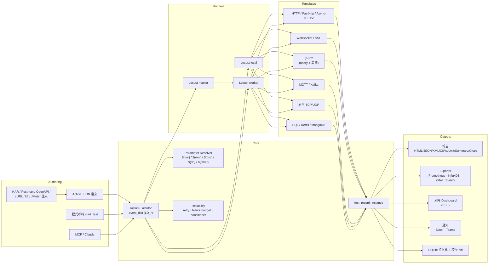
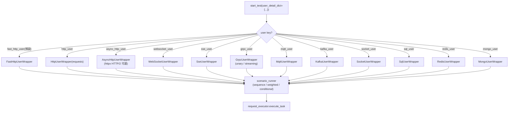

# LoadDensity

<p align="center">
  <strong>多協定壓力與負載自動化框架:Locust + WebSocket + gRPC + MQTT + 原生 socket,搭配內建電池的 JSON 動作執行器。</strong>
</p>

<p align="center">
  <a href="https://pypi.org/project/je-load-density/"></a>
  <a href="https://pypi.org/project/je-load-density/"></a>
  <a href="https://github.com/Integration-Automation/LoadDensity/blob/main/LICENSE"></a>
  <a href="https://loaddensity.readthedocs.io/en/latest/"></a>
</p>

<p align="center">
  <a href="../README.md">English</a> |
  <a href="README_zh-CN.md">简体中文</a>
</p>

---

LoadDensity(`je_load_density`)從 Locust 封裝起家,逐步擴展為完整的多協定負載框架:HTTP、FastHttp、WebSocket、gRPC、MQTT、原生 TCP/UDP,再加上 SQL、Redis、Kafka、MongoDB、SSE、Async HTTP/2 等使用者模板,皆透過同一個 JSON 驅動的動作執行器;另含資料參數化、情境流程、報告、可觀測性、分散式 runner、錄製、持久化儲存、可靠性(自適應重試 / 失敗預算 / 網路條件)、即時 dashboard、Slack/Teams 通知、Auth(OAuth2 / JWT / AWS SigV4),以及讓 Claude 端對端驅動測試的 MCP 控制介面。每個 executor 指令以 `LD_*` 命名、使用單一派發點,因此一份動作 JSON 可同時混用協定、exporter 與報告。

> **選用相依、可選安裝** — 每個協定驅動與 exporter 都以 `pip install je_load_density[<extra>]` 提供。僅做 HTTP 壓測者執行期不受影響。

## 目次

- [亮點](#亮點)
- [安裝](#安裝)
- [架構](#架構)
  - [系統總覽](#系統總覽)
  - [動作生命週期](#動作生命週期)
  - [User 派發](#user-派發)
  - [模組地圖](#模組地圖)
- [Quick Start](#quick-start)
- [食譜 (Recipes)](#食譜-recipes)
- [核心 API](#核心-api)
- [動作 Executor](#動作-executor)
- [使用者模板](#使用者模板)
- [參數解析器](#參數解析器)
- [情境模式](#情境模式)
- [斷言與擷取](#斷言與擷取)
- [報告](#報告)
- [可觀測性](#可觀測性)
- [分散式 Master / Worker](#分散式-master--worker)
- [HAR 錄製/重放](#har-錄製重放)
- [持久化紀錄(SQLite)](#持久化紀錄sqlite)
- [MCP Server(給 Claude)](#mcp-server給-claude)
- [硬化控制 Socket](#硬化控制-socket)
- [SLA Gate 與跨次回歸 Diff](#sla-gate-與跨次回歸-diff)
- [Load Shapes](#load-shapes)
- [Think Time 與 Throttle](#think-time-與-throttle)
- [匯入器](#匯入器)
- [Action JSON Linter / Schema / LSP](#action-json-linter--schema--lsp)
- [GitHub Actions 註解](#github-actions-註解)
- [可靠度](#可靠度)
- [即時 Dashboard](#即時-dashboard)
- [Slack / Teams / StatsD](#slack--teams--statsd)
- [Auth](#auth)
- [k6 / JMeter 匯入器](#k6--jmeter-匯入器)
- [GitHub Action 與 pre-commit](#github-action-與-pre-commit)
- [VS Code 擴充套件](#vs-code-擴充套件)
- [範例與本地實驗環境](#範例與本地實驗環境)
- [GUI](#gui)
- [CLI 用法](#cli-用法)
- [測試紀錄](#測試紀錄)
- [例外處理](#例外處理)
- [日誌](#日誌)
- [支援平台](#支援平台)
- [授權](#授權)

## 亮點

- **一個 executor,41 種 user type。** HTTP、FastHttp、**Async HTTP/2 (httpx)**、HTTP/3、WebSocket、SSE、gRPC(unary 與 server/client/bidi 串流)、MQTT、原生 TCP/UDP、SQL(SQLAlchemy)、Redis、Kafka、**MongoDB**,以及更多協定(AMQP、NATS、Pulsar、Cassandra、Elasticsearch、Modbus、OPC-UA、LDAP、SNMP、SMTP/IMAP、FTP/SFTP 等)— 全部透過同一個 `LD_start_test` 以 `user_detail_dict["user"]` 切換派發。
- **動作 JSON 即契約。** 每個指令皆由 `Executor.event_dict` 解析;不論手寫、HAR 匯入、控制 socket 傳送或 MCP 工具呼叫,動作列表格式相同。
- **參數解析器處處可用。** `${var.NAME}`、`${env.NAME}`、`${csv.SOURCE.COL}`、`${db.SOURCE.COL}`、`${faker.method}`,以及內建 `${uuid()}`、`${now()}`、`${randint(min,max)}`;從前一個回應擷取的值可餵給下一個 task 的 URL、header、body 或斷言。
- **無需寫 Python 的情境流程。** task 流程以 `sequence`(預設)、`weighted`、`conditional`(`run_if`/`skip_if`)宣告;per-task `think_time`、`throttle.rps`、`retry`(`{transient, flaky, permanent}` 預算)直接控制節奏與韌性。
- **內建 load shapes。** `load_shape="stages"|"spike"|"soak"` + JSON `shape_config`,免寫 Locust subclass。
- **生產等級可靠度。** 自適應重試(指數退避 + 抖動 + 三級錯誤預算)、滑動視窗失敗預算 / circuit breaker、process supervisor 與硬牆鐘 watchdog、in-process 網路條件(latency / jitter / loss)。
- **SLA gate + 跨次回歸 diff。** `LD_assert_sla` 在 latency / failure_rate / requests 規則破線時讓 CI 失敗;`LD_diff_runs` 比對兩個 SQLite run,容忍範圍外的 per-name 回歸會被標出。
- **七種報告格式。** HTML、JSON、XML、CSV、JUnit XML、百分位摘要 JSON,另含選用的 matplotlib **chart 報告**(`latency-over-time` + `RPS-over-time` PNG,需 `[charts]` extra)。
- **四種即時 exporter。** Prometheus HTTP 端點、InfluxDB line-protocol UDP/HTTP sink、OpenTelemetry OTLP gRPC、**Datadog DogStatsD UDP**,全部 lazy import 並由對應 install extra 控制。
- **即時 web dashboard。** `start_dashboard()` 啟動 stdlib HTTP + SSE 伺服器,即時把 RPS / avg / p95 / failure 推送到瀏覽器,含 per-name 表格。
- **Slack + Teams 通知。** `LD_post_slack_summary`(Block Kit)與 `LD_post_teams_summary`(MessageCard),自動取自 build_summary 結果。
- **斷言與擷取。** `status_code`、`contains`、`not_contains`、`json_path`、`header` 斷言在 Locust 的 `catch_response` 下執行;擷取來源 `json_path`/`header`/`status_code` 會寫回參數解析器。
- **分散式 runner。** `runner_mode="master"`/`"worker"`,跨機壓測共用同一份 `start_test` API;master 等待設定的 worker 數量(最多 60 秒)後再開始 ramp。
- **六種匯入器。** HAR(瀏覽流量)、Postman v2.1、OpenAPI 3.x、cURL、**k6 腳本**、**JMeter JMX** — 全部可轉成 action JSON 或單一 task。
- **Auth 工具。** stdlib OAuth2 client(`client_credentials` / `password` / `refresh` 含 token cache)、JWT 簽發(HS256/384/512 + RS256/384/512)、AWS SigV4 簽章,所有 HTTP user template 透過 `task["cert"]` 即可走 mTLS。
- **持久化紀錄。** 選用 SQLite sink,含 `runs`/`records`/`metadata` schema 並建立索引;空檔即可直接使用,便於跨次回歸比對。
- **MCP server。** `python -m je_load_density.mcp_server` 對外開 13 個工具,讓 Claude(Desktop、Code、任何 MCP client)端對端驅動 LoadDensity。
- **Action JSON 工具鏈。** 內建 linter(`LD_lint_action`)、JSON Schema 匯出(`LD_export_schema`)、GitHub Actions 註解(`LD_emit_github_annotations`)、stdlib LSP server(`python -m je_load_density.action_lsp`)、composite **GitHub Action** 包裝(`action.yml`)、**pre-commit hook**、**VS Code 擴充套件** 骨架 — 編輯器 + CI 整合完整覆蓋。
- **硬化控制 socket。** 4-byte big-endian 長度前綴 framing(上限 1 MiB)、選用 TLS、共享密鑰 token(環境變數或參數),並保留與 PyBreeze 等工具相容的 legacy 模式。
- **安全 executor。** 動作 JSON 內 `eval`、`exec`、`compile`、`__import__`、`breakpoint`、`open`、`input` 一律封鎖。
- **即時 GUI。** 選用的 PySide6 GUI 含即時統計面板(RPS、平均、p95、失敗),翻譯為英文、繁中、日文、韓文。
- **CLI 子指令。** `run`/`run-dir`/`run-str`/`init`/`bench`/`shell`/`serve`,並保留舊式單旗標形式以相容下游工具。
- **跨平台。** Windows 10/11、macOS、Ubuntu/Linux、Raspberry Pi(3B+ 以上),Python 3.10+。

## 安裝

**穩定版:**

```bash
pip install je_load_density
```

引入 [Locust](https://locust.io/) 與 `defusedxml`,僅此而已。

### 選用 extras

僅安裝所需切片:

| Extra | 加入 |
|-------|------|
| `gui` | PySide6 + qt-material(圖形介面) |
| `websocket` | `websocket-client`(WebSocket user 模板) |
| `grpc` | `grpcio` + `protobuf`(gRPC user 模板) |
| `mqtt` | `paho-mqtt`(MQTT user 模板) |
| `redis` | `redis`(Redis user 模板) |
| `kafka` | `kafka-python`(Kafka user 模板) |
| `sql` | `sqlalchemy`(SQL user 模板 + `${db.*}` 占位符) |
| `mongo` | `pymongo`(MongoDB user 模板) |
| `http2` | `httpx[http2]`(Async HTTP/2 user 模板) |
| `auth` | `cryptography`(RS256/384/512 JWT 簽發) |
| `reliability` | `psutil`(ProcessSupervisor) |
| `prometheus` | `prometheus-client`(Prometheus exporter) |
| `opentelemetry` | OpenTelemetry SDK + OTLP gRPC exporter |
| `metrics` | `prometheus` + `opentelemetry` 一次裝齊 |
| `charts` | `matplotlib`(chart 報告) |
| `yaml` | `pyyaml`(OpenAPI YAML 載入) |
| `faker` | `Faker`(驅動 `${faker.method}` 占位符) |
| `all` | 上列全部 |

```bash
pip install "je_load_density[gui]"
pip install "je_load_density[mqtt,grpc,websocket]"
pip install "je_load_density[metrics]"
pip install "je_load_density[all]"
```

### 開發安裝

```bash
git clone https://github.com/Integration-Automation/LoadDensity.git
cd LoadDensity
pip install -e ".[all]"
pip install -r requirements.txt
```

硬性需求:Python **3.10+**、`locust`、`defusedxml`。

## 架構

### 系統總覽



### 動作生命週期

```mermaid
flowchart LR
  IN["Action<br/>[cmd, args_or_kwargs]"] --> DISP["event_dict[cmd]"]
  DISP -- "LD_start_test" --> SEED["依 variables / csv_sources /<br/>db_sources 填入 resolver"]
  SEED --> PICK["挑選 user 模板"]
  PICK --> ENV["prepare_env<br/>(local / master / worker · load_shape)"]
  ENV --> RUN["Locust runner tick"]
  RUN --> THR["throttle.rps 限流"]
  THR --> COND["network conditioner<br/>(latency / jitter / loss)"]
  COND --> EXPAND["參數解析器<br/>展開 task ${...}"]
  EXPAND --> RETRY["per-task retry policy<br/>(transient / flaky / permanent)"]
  RETRY --> EXEC["execute_task"]
  EXEC -- 回應 --> ASSERT["assertions + extractors"]
  ASSERT --> EVT["Locust request 事件"]
  EVT --> REC["test_record_instance.append"]
  EVT --> FB["failure_budget · 超標即 trip"]
```



### User 派發



### 模組地圖

```
je_load_density/
├── __init__.py                       # 公開 API re-export
├── __main__.py                       # CLI: run / run-dir / run-str / init / bench / shell / serve
├── action_lsp/                       # 動作 JSON 的 LSP 伺服器
├── mcp_server/                       # MCP server(13 個給 Claude 的工具)
├── tools/                            # CLI 工具(pre-commit linter 等)
├── gui/                              # 選用 PySide6 前端
├── utils/
│   ├── auth/                         # OAuth2 / JWT / AWS SigV4
│   ├── callback/                     # callback_executor
│   ├── ci_annotations/               # GitHub Actions 註解
│   ├── dashboard/                    # 即時 web dashboard (SSE)
│   ├── exception/                    # LoadDensity* 例外階層
│   ├── executor/                     # Executor · event_dict · 安全 builtins
│   ├── file_process/                 # 目錄走訪 · 專案 scaffold
│   ├── generate_report/              # HTML / JSON / XML / CSV / JUnit / Summary / Chart
│   ├── get_data_structure/           # API 資料 helper(舊)
│   ├── graphql/                      # GraphQL helper
│   ├── json/                         # JSON 讀寫
│   ├── linter/                       # Action JSON linter
│   ├── load_shapes/                  # Stages / Spike / Soak
│   ├── logging/                      # 已設定 logger
│   ├── metrics/                      # Prometheus · InfluxDB · OTel · StatsD
│   ├── notifier/                     # Slack · Teams
│   ├── package_manager/              # 動態套件載入
│   ├── parameterization/             # ParameterResolver(var / env / csv / db / faker)
│   ├── project/                      # 專案範本
│   ├── recording/                    # HAR / Postman / OpenAPI / cURL / k6 / JMeter
│   ├── regression/                   # 跨次 diff
│   ├── reliability/                  # adaptive_retry / failure_budget /
│   │                                 # network_conditioner / process_supervisor
│   ├── schema/                       # JSON Schema 匯出
│   ├── sla/                          # SLA gate
│   ├── socket_server/                # 長度框架 TCP 控制 plane(+TLS+token)
│   ├── test_record/                  # 記憶體紀錄 + SQLite 持久化
│   ├── throttle/                     # 共享 token-bucket
│   └── xml/                          # defusedxml XML helper
└── wrapper/
    ├── create_locust_env/            # prepare_env / create_env(local/master/worker + shape)
    ├── event/                        # request_hook(Locust 事件 → 紀錄)
    ├── proxy/                        # 各協定 task store(locust_wrapper_proxy)
    └── user_template/                # 12 種 Locust user + scenario_runner + request_executor
load_density_driver/                  # 獨立 driver 建置
examples/                             # 12 個可執行範例
docker/                               # httpbin / mosquitto / redis / kafka / prometheus
editors/vscode/                       # VS Code 擴充套件骨架
action.yml                            # composite GitHub Action
.pre-commit-hooks.yaml                # pre-commit 入口
test/                                 # pytest 測試
docs/                                 # Sphinx 文件(En / Zh / API)
```

## Quick Start

### 以 Python 跑 HTTP 壓測

```python
from je_load_density import start_test

start_test(
    user_detail_dict={"user": "fast_http_user"},
    user_count=50,
    spawn_rate=10,
    test_time=30,
    variables={"base": "https://httpbin.org"},
    tasks=[
        {"method": "get",  "request_url": "${var.base}/get"},
        {"method": "post", "request_url": "${var.base}/post",
         "json": {"hello": "world"},
         "assertions": [{"type": "status_code", "value": 200}]},
    ],
)
```

### Action JSON

```json
{"load_density": [
  ["LD_register_variables", {"variables": {"base": "https://httpbin.org"}}],
  ["LD_start_test", {
    "user_detail_dict": {"user": "fast_http_user"},
    "user_count": 20, "spawn_rate": 10, "test_time": 30,
    "tasks": [
      {"method": "get",  "request_url": "${var.base}/get"},
      {"method": "post", "request_url": "${var.base}/post",
       "json": {"hello": "world"}}
    ]
  }],
  ["LD_generate_summary_report", {"report_name": "smoke"}]
]}
```

由 CLI 執行:

```bash
python -m je_load_density run smoke.json
```

### Action 形式

```python
["command"]                                    # 無參數
["command", {"key": "value"}]                  # kwargs
["command", [arg1, arg2]]                      # positional
```

最外層可為純 list,或 `{"load_density": [...]}` wrapper。

## 食譜 (Recipes)

最常用的需求做成短小可複製範例。

| 食譜 | 展示 |
|---|---|
| **HTTP smoke** | `fast_http_user` + `status_code` 斷言 + summary 報告 |
| **登入流程** | `extract` 取 token,後續 task 以 `${var.auth}` 帶 header |
| **加權混合** | `mode: "weighted"` + `weight` 偏向熱門端點 |
| **WebSocket echo** | `websocket_user` `connect → sendrecv → close` |
| **gRPC unary / 串流** | `grpc_user` 配 `rpc: "server_stream"` / `"client_stream"` / `"bidi"` |
| **MQTT pub/sub** | `mqtt_user` `connect → subscribe → publish → disconnect` |
| **原生 TCP/UDP** | `socket_user` 帶 `payload` 與 `expect_substring` |
| **SQL / Redis / Mongo** | 三種資料層 user template,內含 expect 斷言 |
| **Async HTTP/2** | `async_http_user` + `http2=True`(httpx) |
| **分散式跑法** | 一個 master + N 個 worker,對同一份 action JSON |
| **HAR / Postman / OpenAPI / k6 / JMeter** | 對應 `LD_*_to_action_json` 匯入器 |
| **匯出指標** | Prometheus / InfluxDB / OTel / DogStatsD |
| **持久化結果** | `LD_persist_records` → SQLite → `LD_diff_runs` |
| **SLA gate** | `LD_assert_sla` 在 latency / failure_rate 破線時失敗 |
| **Spike shape** | `load_shape="spike"` + `shape_config` |
| **Think time + throttle** | `task["think_time"]` 與 `task["throttle"]={"rps":...}` |
| **可靠度** | `LD_install_failure_budget` + `LD_install_network_conditioner` + per-task `retry` |
| **即時 Dashboard** | `LD_start_dashboard` 後瀏覽 `http://127.0.0.1:8765` |
| **Slack / Teams** | `LD_post_slack_summary` / `LD_post_teams_summary` |
| **OAuth2 / JWT / AWS SigV4** | `OAuth2Client` 含 token cache · `sign_jwt` · `sign_aws_request` |
| **mTLS** | task 加 `"cert": ["client.pem","key.pem"]` |
| **MCP 驅動** | Claude 連 `python -m je_load_density.mcp_server` |

完整參數請對照目次的對應章節。

## 核心 API

```python
from je_load_density import (
    start_test, prepare_env, create_env,
    execute_action, execute_files, executor, add_command_to_executor,
    test_record_instance, locust_wrapper_proxy,
    register_variable, register_variables,
    register_csv_source, register_csv_sources,
    register_db_source, register_db_sources,
    parameter_resolver, resolve,
    # 匯入器
    har_to_action_json, har_to_tasks, load_har,
    postman_to_action_json, postman_to_tasks, load_postman_collection,
    openapi_to_action_json, openapi_to_tasks, load_openapi,
    curl_to_task,
    k6_script_to_action_json, k6_script_to_tasks, load_k6_script,
    jmeter_to_action_json, jmeter_to_tasks, load_jmeter_jmx,
    # 報告 / 持久化
    generate_html_report, generate_json_report, generate_xml_report,
    generate_csv_report, generate_junit_report, generate_summary_report,
    generate_chart_report, build_summary,
    persist_records, list_runs, fetch_run_records,
    diff_runs, summarise_records,
    # SLA / 場景
    evaluate_sla, assert_sla,
    SoakShape, SpikeShape, StagesShape, build_load_shape,
    RpsThrottle, get_throttle, reset_throttles,
    # Exporter
    start_prometheus_exporter, stop_prometheus_exporter,
    start_influxdb_sink, stop_influxdb_sink,
    start_opentelemetry_exporter, stop_opentelemetry_exporter,
    start_statsd_sink, stop_statsd_sink,
    # 可靠度
    AdaptiveRetryPolicy, run_with_retry, classify_error,
    FailureBudget, install_failure_budget, uninstall_failure_budget,
    NetworkConditioner,
    install_network_conditioner, uninstall_network_conditioner,
    ProcessSupervisor, with_watchdog,
    # 通知 / Dashboard
    snapshot_metrics, start_dashboard, stop_dashboard,
    post_slack_summary, build_slack_summary,
    post_teams_summary, build_teams_summary,
    # Auth
    OAuth2Client,
    fetch_client_credentials_token, fetch_password_token, refresh_token,
    sign_jwt, decode_jwt, sign_aws_request,
    # 工具
    lint_action, lint_action_file,
    action_json_schema, export_schema,
    emit_github_annotations, format_github_annotation,
    graphql_to_http_task, extract_field,
    start_load_density_socket_server,
    create_project_dir, callback_executor, read_action_json,
)
```

完整公開介面定義於 `je_load_density/__init__.py` 的 `__all__`(108 條)。

## 動作 Executor

| 類別 | 指令 |
|------|------|
| 核心 | `LD_start_test`、`LD_execute_action`、`LD_execute_files`、`LD_add_package_to_executor`、`LD_start_socket_server` |
| 報告 | `LD_generate_html(_report)`、`LD_generate_json(_report)`、`LD_generate_xml(_report)`、`LD_generate_csv_report`、`LD_generate_junit_report`、`LD_generate_summary_report`、`LD_generate_chart_report`、`LD_summary` |
| 持久化 | `LD_persist_records`、`LD_list_runs`、`LD_fetch_run_records`、`LD_clear_records` |
| 參數 | `LD_register_variable(s)`、`LD_register_csv_source(s)`、`LD_register_db_source(s)`、`LD_clear_resolver` |
| 錄製 / 匯入 | `LD_load_har`、`LD_har_to_*`、`LD_postman_to_*`、`LD_openapi_to_*`、`LD_curl_to_task`、`LD_k6_script_to_*`、`LD_jmeter_to_*` |
| 指標 | `LD_start/stop_prometheus_exporter`、`LD_start/stop_influxdb_sink`、`LD_start/stop_opentelemetry_exporter`、`LD_start/stop_statsd_sink` |
| 品質 / DX | `LD_lint_action(_file)`、`LD_export_schema`、`LD_emit_github_annotations` |
| SLA / 回歸 | `LD_evaluate_sla`、`LD_assert_sla`、`LD_diff_runs` |
| 可靠度 | `LD_install/uninstall_failure_budget`、`LD_install/uninstall_network_conditioner` |
| Dashboard / 通知 | `LD_start/stop_dashboard`、`LD_post_slack_summary`、`LD_post_teams_summary` |

安全 builtins(`print`、`len`、`range`…)亦可呼叫;`eval`、`exec`、`compile`、`__import__`、`breakpoint`、`open`、`input` 一律禁止。

### 自訂指令

```python
from je_load_density import add_command_to_executor

def slack_notify(message: str) -> None:
    ...

add_command_to_executor({"LD_slack_notify": slack_notify})
```

## 使用者模板

所有 user type 透過 `start_test(user_detail_dict={"user": "<key>"})` 註冊;task 共用相同 schema,僅協定欄位不同。41 種 user type 的詳細欄位與範例,請見英文 README 對應段落(本節結構相同,僅就重點列出)。

* `fast_http_user` / `http_user` — 預設 HTTP 壓測,task 支援 `cert` 走 mTLS。
* `async_http_user` — httpx 後端,可開 HTTP/2:`start_test(user="async_http_user", http2=True, ...)`。
* `websocket_user` / `sse_user` — 串流型,`connect → sendrecv|wait → close`。
* `grpc_user` — task 加 `rpc: "server_stream"` / `"client_stream"` / `"bidi"`;`payload` 為 list 即為 client 串流。
* `mqtt_user` / `kafka_user` — pub/sub。
* `socket_user` — 原生 TCP/UDP。
* `sql_user` — SQLAlchemy `text(...)`,task 含 `expect_rows`。
* `redis_user` — `get/set/incr/lpush/rpop/delete/exists`。
* `mongo_user` — `find_one/find/insert_one/update_one/delete_one/count`,含 `expect_min`。

## 參數解析器

占位符會在每個 task 自動展開:

| 占位符 | 解析為 |
|--------|--------|
| `${var.NAME}` | `register_variable(s)` 傳入的值 |
| `${env.NAME}` | 環境變數 |
| `${csv.SOURCE.COL}` | CSV 源 `SOURCE` 的下一列(預設循環) |
| `${db.SOURCE.COL}` | SQLAlchemy 查詢結果的下一列(`register_db_source`) |
| `${faker.METHOD}` | `Faker().METHOD()`(lazy) |
| `${uuid()}` | UUID 4 |
| `${now()}` | 本地 ISO-8601 時間戳 |
| `${randint(min, max)}` | 加密強度隨機整數 |

未知占位符會保持原樣,以便 dry run 時看出缺資料。

## 情境模式

```json
{
  "mode": "weighted",
  "tasks": [
    {"method": "get", "request_url": "/products", "weight": 3},
    {"method": "get", "request_url": "/expensive", "weight": 1}
  ]
}
```

| 模式 | 行為 |
|------|------|
| `sequence` | 每 tick 依序執行全部 task(預設) |
| `weighted` | 每 tick 依 `weight` 挑一個 task |
| `conditional` | 由 `run_if` / `skip_if` 對 resolver 求值 |

per-task 控制欄位:`think_time`、`throttle.rps`、`retry.{transient,flaky,permanent,base_delay,max_delay,backoff_factor,jitter}`。

## 斷言與擷取

```json
{
  "method": "post",
  "request_url": "${var.base}/login",
  "json": {"email": "u@example.com", "password": "secret"},
  "assertions": [
    {"type": "status_code", "value": 200},
    {"type": "json_path", "path": "data.role", "value": "admin"}
  ],
  "extract": [
    {"var": "auth_token", "from": "json_path", "path": "data.token"},
    {"var": "request_id", "from": "header",    "name": "X-Request-Id"}
  ]
}
```

斷言類型:`status_code`、`contains`、`not_contains`、`json_path`、`header`。擷取來源:`json_path`、`header`、`status_code`。

## 報告

| 格式 | 輸出 |
|------|------|
| HTML | `<base>.html`(成功 + 失敗 表格,色彩標記) |
| JSON | `<base>_success.json` + `<base>_failure.json` |
| XML | `<base>_success.xml` + `<base>_failure.xml` |
| CSV | `<base>.csv` |
| JUnit | `<base>-junit.xml`(CI 友善) |
| Summary | `<base>.json`(per-name p50/p90/p95/p99) |
| Chart | `<base>-latency.png` + `<base>-rps.png`(`[charts]` extra) |

## 可觀測性

```python
from je_load_density import (
    start_prometheus_exporter, start_influxdb_sink,
    start_opentelemetry_exporter, start_statsd_sink,
)

start_prometheus_exporter(port=9646, addr="127.0.0.1")
start_influxdb_sink(transport="udp", host="influxdb", port=8089)
start_opentelemetry_exporter(endpoint="http://otel-collector:4317",
                             service_name="loaddensity")
start_statsd_sink(host="dogstatsd", port=8125, prefix="loaddensity")
```

## 分散式 Master / Worker

```python
# master
start_test(user_detail_dict={"user": "fast_http_user"},
           runner_mode="master", master_bind_host="0.0.0.0", master_bind_port=5557,
           expected_workers=4, user_count=400, spawn_rate=40, test_time=600,
           tasks=[...])

# worker
start_test(user_detail_dict={"user": "fast_http_user"},
           runner_mode="worker", master_host="10.0.0.10", master_port=5557,
           tasks=[...])
```

master 等待最多 60 秒讓 `expected_workers` 完成註冊後開始 ramp。

## HAR 錄製/重放

```python
from je_load_density import load_har, har_to_action_json

action_json = har_to_action_json(
    load_har("recording.har"),
    user="fast_http_user", user_count=20, spawn_rate=10, test_time=120,
    include=[r"api\.example\.com"], exclude=[r"\.svg$"],
)
```

## 持久化紀錄(SQLite)

```python
from je_load_density import persist_records, list_runs, diff_runs

run_id = persist_records("loadtests.db", label="checkout-2026-05-26",
                          metadata={"branch": "dev", "commit": "abc1234"})

report = diff_runs("loadtests.db", baseline_run_id=42, current_run_id=run_id,
                    tolerance=0.10)
if report["has_regressions"]:
    raise SystemExit(report["regressions"])
```

## MCP Server(給 Claude)

```bash
pip install je_load_density
python -m je_load_density.mcp_server
```

server 自己在 stdio 上講 MCP(JSON-RPC 2.0,一行一則訊息),不需要 `mcp` SDK;`[mcp]` extra 是空的,只是讓舊的安裝指令還能用。

13 個工具:`run_test`、`run_action_json`、`create_project`、`list_executor_commands`、`import_har`、`generate_reports`、`summary`、`persist_records`、`list_runs`、`fetch_run`、`clear_records`、`generate_from_openapi`、`generate_from_curls`。

## 硬化控制 Socket

```bash
python -m je_load_density serve \
    --host 0.0.0.0 --port 9940 --framed \
    --token "$LOAD_DENSITY_SOCKET_TOKEN" \
    --tls-cert /etc/loaddensity/server.crt \
    --tls-key /etc/loaddensity/server.key
```

* 4-byte big-endian 長度前綴 framing(1 MiB 上限)
* 選用 TLS(磁碟 cert/key,最低 TLS 1.2)
* 共享密鑰 token 以 `hmac.compare_digest` 比對
* token 亦讀自 `LOAD_DENSITY_SOCKET_TOKEN`
* 保留 legacy 模式以維持相容

## SLA Gate 與跨次回歸 Diff

```python
from je_load_density import assert_sla, build_summary, diff_runs

assert_sla([
    {"type": "failure_rate", "value": 0.02},
    {"type": "latency_p95", "value": 800},
    {"type": "latency_p95", "name": "/checkout", "value": 500},
    {"type": "requests", "op": "gte", "value": 1000},
], summary=build_summary())

report = diff_runs("loadtests.db", baseline_run_id=42, current_run_id=43,
                    tolerance=0.10)
if report["has_regressions"]:
    raise SystemExit(report["regressions"])
```

支援規則類型:`latency_p50/_p90/_p95/_p99`、`latency_mean`、`failure_rate`、`requests`。`op` 為 `lt`(預設 `lte`)、`gt`、`gte`。指定 `name` 時即為 per-endpoint 規則。

## Load Shapes

```python
start_test(
    user_detail_dict={"user": "fast_http_user"},
    load_shape="spike",
    shape_config={"baseline_users": 20, "spike_users": 200,
                  "spawn_rate": 50, "pre_seconds": 30,
                  "spike_seconds": 30, "post_seconds": 30},
    tasks=[...],
)
```

內建:`"stages"`(list of `{duration, users, spawn_rate}`)、`"spike"`、`"soak"`。背後都會轉成 Locust `LoadTestShape` 子類別。

## Think Time 與 Throttle

```json
[
  {"method": "get", "request_url": "${var.base}/home",
   "think_time": {"min": 0.5, "max": 1.5}},
  {"method": "get", "request_url": "${var.base}/checkout",
   "throttle": {"key": "checkout", "rps": 25, "burst": 5}}
]
```

兩者皆 per-task,在請求發出前解析。Throttle bucket 由 `key` 共用,跨 user 共享同一個 cap。

## 匯入器

```python
from je_load_density import (
    load_har, har_to_action_json,
    load_postman_collection, postman_to_action_json,
    load_openapi, openapi_to_action_json,
    curl_to_task,
    load_k6_script, k6_script_to_action_json,
    load_jmeter_jmx, jmeter_to_action_json,
)
```

OpenAPI 會把 `{param}` 路徑參數轉成 `${var.param}`;k6 把 `check()` 內的 `is 200` 解為 `status_code` 斷言;JMeter 會繼承同階層 HeaderManager。

## Action JSON Linter / Schema / LSP

```python
from je_load_density import lint_action, export_schema

findings = lint_action({"load_density": [["LD_typo"]]})
# [{'rule': 'unknown-command', 'severity': 'error', ...}]

export_schema("docs/reference/loaddensity-action-schema.json")
```

LSP server(stdio):

```bash
python -m je_load_density.action_lsp   # 或: loaddensity-lsp
```

`textDocument/completion` 回傳每個 `LD_*` 指令;`publishDiagnostics` 在每次變更執行 linter。

## GitHub Actions 註解

```python
from je_load_density import emit_github_annotations

emit_github_annotations(title="LoadDensity")
# ::error title=LoadDensity::GET /checkout (HTTP 500): timeout
```

每筆失敗紀錄一行 `::error::`,reviewer 可在 PR *Files Changed* 直接看到。

## 可靠度

```python
from je_load_density import (
    AdaptiveRetryPolicy, run_with_retry,
    install_failure_budget, install_network_conditioner,
    with_watchdog,
)

# 自適應重試
policy = AdaptiveRetryPolicy(transient_budget=5, flaky_budget=2,
                              base_delay=0.1, max_delay=2.0)
run_with_retry(lambda: do_request(), policy=policy)

# task 內宣告:task["retry"] = {"transient": 3, "flaky": 1, "base_delay": 0.2}

# 失敗預算 — 過去 30s 失敗率 > 5% 即中止
install_failure_budget(threshold=0.05, window_seconds=30,
                       runner_quit_callback=lambda: env.runner.quit())

# 網路條件注入
install_network_conditioner(latency_ms=50, jitter_ms=20, loss_rate=0.01,
                             name_filter="/checkout")

# watchdog 強制中止僵屍 CI 跑
with_watchdog(lambda: execute_action(action_json), timeout_seconds=600)
```

## 即時 Dashboard

```python
from je_load_density import start_dashboard

start_dashboard(host="127.0.0.1", port=8765, refresh_seconds=1.0)
# 瀏覽 http://127.0.0.1:8765,/events 走 SSE 串流 JSON 快照
```

## Slack / Teams / StatsD

```python
from je_load_density import (
    post_slack_summary, post_teams_summary, start_statsd_sink,
)

start_statsd_sink(host="dogstatsd", port=8125, prefix="loaddensity")
post_slack_summary("https://hooks.slack.com/services/...")
post_teams_summary("https://outlook.office.com/webhook/...")
```

## Auth

```python
from je_load_density import OAuth2Client, sign_jwt, sign_aws_request

client = OAuth2Client("https://idp/token", "id", "secret", scope="read:x")
token = client.get_client_credentials()   # cache 至 expires_in 結束

jwt = sign_jwt({"sub": "alice"}, secret="topsecret",
                algorithm="HS256", expires_in_seconds=300)

aws_headers = sign_aws_request(
    method="GET",
    url="https://s3.amazonaws.com/mybucket/key",
    region="us-east-1", service="s3",
    access_key="AK", secret_key="sk",
)
```

mTLS:

```json
{"method": "get", "request_url": "https://mtls.api/x",
 "cert": ["/etc/ssl/client.pem", "/etc/ssl/key.pem"]}
```

## k6 / JMeter 匯入器

```python
from je_load_density import (
    load_k6_script, k6_script_to_action_json,
    load_jmeter_jmx, jmeter_to_action_json,
)

action = k6_script_to_action_json(load_k6_script("script.js"))
action = jmeter_to_action_json(load_jmeter_jmx("plan.jmx"))
```

加上既有的 HAR / Postman / OpenAPI / cURL,LoadDensity 已涵蓋常見壓測工具的腳本格式。

## GitHub Action 與 pre-commit

```yaml
# .github/workflows/load.yml
- uses: ./   # 或: Integration-Automation/LoadDensity@v1
  with:
    action-file: actions/smoke.json
    extras: "metrics,websocket"
    fail-on-error: "true"
```

```yaml
# .pre-commit-config.yaml
- repo: https://github.com/Integration-Automation/LoadDensity
  rev: v1.0.0
  hooks:
    - id: loaddensity-lint
```

## VS Code 擴充套件

`editors/vscode/` 提供最小擴充套件,以 stdio 啟動 `python -m je_load_density.action_lsp` 取得 completion + diagnostics。`npm install && npm run package` 可打包 `.vsix`。

## 範例與本地實驗環境

* `examples/` 內有 12 個可執行 recipe(smoke、auth flow、weighted mix、WebSocket、MQTT、Redis、spike shape、SLA gate、HAR / Postman / OpenAPI 匯入)。
* `docker/` 一鍵 `docker compose up -d` 啟動 httpbin、Mosquitto、Redis、Kafka、Prometheus 本地實驗環境。

## GUI

```bash
pip install "je_load_density[gui]"
```

```python
import sys
from PySide6.QtWidgets import QApplication
from je_load_density.gui.main_window import LoadDensityUI

app = QApplication(sys.argv)
window = LoadDensityUI()
window.show()
sys.exit(app.exec())
```

GUI 內建英文、繁中、日文、韓文翻譯,即時統計面板每秒輪詢 `test_record_instance`。

## CLI 用法

```
python -m je_load_density run FILE              # 執行單一 action JSON
python -m je_load_density run-dir DIR           # 執行目錄下所有 .json
python -m je_load_density run-str JSON          # 執行內嵌 JSON 字串
python -m je_load_density init PATH             # 建立專案骨架
python -m je_load_density bench URL [--users N] # 無 Locust 的 asyncio HTTP 基準測試
python -m je_load_density shell                 # 預先 import ld 的互動式 REPL
python -m je_load_density serve [--host ...]    # 啟動控制 socket
```

亦提供 console script:`loaddensity` / `loaddensity-mcp` / `loaddensity-lsp`。

## 測試紀錄

`test_record_instance.test_record_list` 與 `error_record_list` 蒐集每次請求,內含 `Method`、`test_url`、`name`、`status_code`、`response_time_ms`、`response_length`,失敗時還會帶 `error`。報告、SQLite sink、SLA gate、Dashboard 都直接讀取這些 list。

## 例外處理

```
LoadDensityTestException
├── LoadDensityTestJsonException
├── LoadDensityGenerateJsonReportException
├── LoadDensityTestExecuteException
├── LoadDensityAssertException
├── LoadDensityHTMLException
├── LoadDensityAddCommandException
├── XMLException → XMLTypeException
└── CallbackExecutorException

CircuitOpenError (utils/reliability/failure_budget.py)
```

所有自訂例外皆繼承 `LoadDensityTestException`(除 `CircuitOpenError`,屬 reliability sub-system)。

## 日誌

LoadDensity 對外提供單一已設定 logger(`load_density_logger`),位於 `je_load_density.utils.logging.loggin_instance`。

## 支援平台

| 平台 | 狀態 |
|------|------|
| Windows 10 / 11 | 完整支援 |
| macOS | 完整支援 |
| Ubuntu / Linux | 完整支援 |
| Raspberry Pi | 已測 3B+ 以上 |

需要 Python 3.10+。

## 授權

MIT — 詳見 [LICENSE](../LICENSE)。

Copyright (c) 2022~2026 JE-Chen
